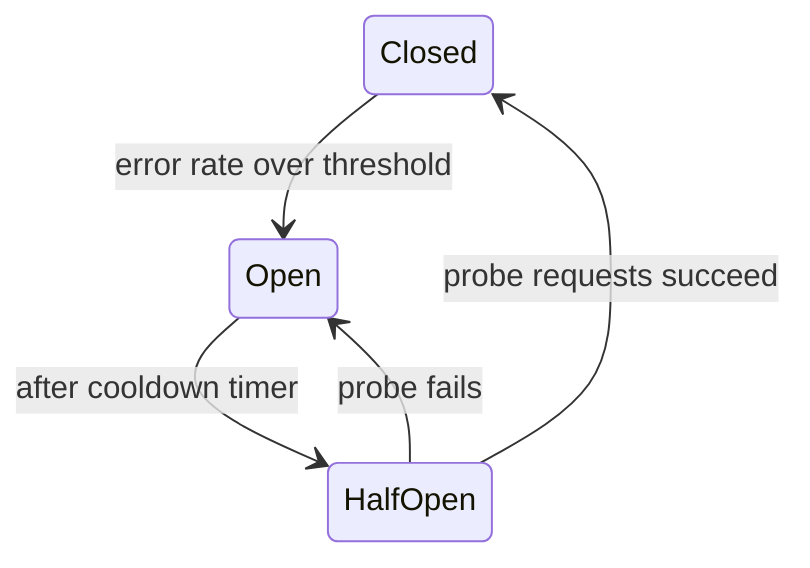

# Circuit breaker

> When a downstream dependency starts failing, stop calling it for a while and fail fast, so one sick service does not take down the whole system.

## What it is

When service B slows down or dies, callers of B start piling up threads and connections waiting on it, then they slow down, then their callers slow down: a cascading failure. A circuit breaker wraps calls to a dependency, watches the error rate, and when it crosses a threshold, "opens" and rejects calls immediately instead of letting them hang. This protects the caller and gives the dependency space to recover.

## How it works

Three states, like the electrical breaker it is named after:

- **Closed** (normal): calls pass through; failures are counted in a rolling window.
- **Open**: calls fail instantly with an error or a fallback; no load reaches the dependency.
- **Half-open**: after a cooldown, let a few probe requests through; success closes the circuit, failure reopens it.

## What to do when the circuit is open

The breaker forces the real design question: what is the degraded experience?

- Return a cached or stale value (fine for a recommendations widget).
- Return a default (empty list, generic response).
- Queue the work for later ([message queue](message-queues.md)) if it does not need to be synchronous.
- Fail visibly, only for truly critical dependencies like payments.

## Related resilience patterns

Circuit breakers travel with **timeouts** (never wait unboundedly), **bounded retries with exponential backoff and jitter** (unbounded retries against a struggling service are a self-inflicted DDoS; see [idempotency](idempotency.md) for making retries safe), and **bulkheads** (separate connection pools per dependency so one bad dependency cannot exhaust shared resources).

## Trade-offs

| Pro | Con |
|-----|-----|
| Stops cascading failures; callers stay responsive | Thresholds need tuning; too sensitive means flapping |
| Sheds load from a struggling dependency so it can recover | Adds state and complexity to every client |
| Forces explicit fallback design | A misconfigured breaker can reject traffic to a healthy service |

## How to talk about it in an interview

Bring it up when asked "what if this service goes down?" The strong answer names the trio: timeout on every call, retries with backoff and jitter, circuit breaker with an explicit fallback behavior. Saying what the user sees while the circuit is open is what separates a memorized term from an understood one.

## Go deeper

- Every pattern, in depth: [System Design Patterns](https://www.designgurus.io/course/system-design-patterns?utm_source=github&utm_medium=repo&utm_campaign=grokking-system-design&utm_content=patterns-circuit-breaker)
- Full course: [Grokking the System Design Interview](https://www.designgurus.io/course/grokking-the-system-design-interview?utm_source=github&utm_medium=repo&utm_campaign=grokking-system-design&utm_content=patterns-circuit-breaker)
- Practice live: [Mock interviews](https://www.designgurus.io/mock-interviews?utm_source=github&utm_medium=repo&utm_campaign=grokking-system-design&utm_content=patterns-circuit-breaker)