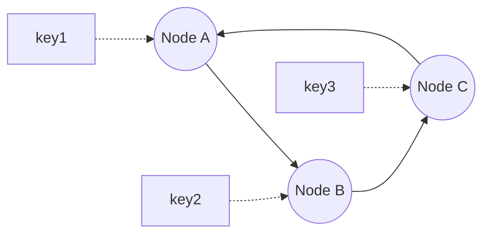

# Consistent hashing

> Distribute keys across nodes so that adding or removing a node moves as little data as possible.

## The problem it solves

Naive sharding with `hash(key) % N` breaks when N changes: adding or removing one node remaps almost every key, causing a storm of data movement and cache misses. Consistent hashing fixes this so that a change affects only a small slice of keys.

## How it works

Map both nodes and keys onto a ring (a hash space treated as a circle). A key belongs to the first node found by moving clockwise from the key's position. When a node is added or removed, only the keys between it and its neighbor move; everything else stays put.

The nodes form a ring (A to B to C and back to A). Each key is owned by the first node found moving clockwise from the key's position.

## Virtual nodes

A plain ring can distribute load unevenly, and removing a node dumps all its keys onto one neighbor. The fix is virtual nodes: each physical node is placed at many points on the ring. This smooths the distribution and spreads a departed node's keys across many others.

## Where it is used

Distributed caches (for example Memcached clients), partitioned data stores (Cassandra, DynamoDB style systems), and load balancers that need sticky, even distribution.

## Trade-offs

| Pro | Con |
|-----|-----|
| Minimal data movement when nodes change | More complex than modulo hashing |
| Even load with virtual nodes | Still needs care for hot keys |

## How to talk about it in an interview

Explain why modulo hashing fails on resize, then describe the ring and virtual nodes. This comes up whenever you shard a cache or a data store and the node count can change.

## Go deeper

- Read more (free): [Consistent Hashing vs Traditional Hashing](https://www.designgurus.io/blog/consistent-hashing-vs-traditional-hashing)
- Full course: [Grokking the System Design Interview](https://www.designgurus.io/course/grokking-the-system-design-interview)