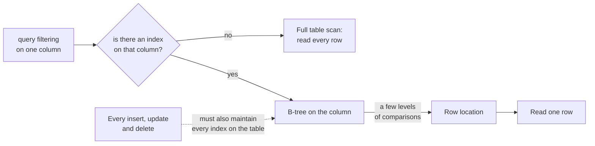

# Database indexing

> A data structure that lets the database find rows by a key without scanning the whole table.

## What it is

An index buys reads and charges writes. Both halves belong in the answer:

An index is a separate, sorted (or hashed) structure that maps column values to row locations. It turns a full table scan into a fast lookup. The cost is extra storage and slower writes, because every insert, update, or delete must also maintain the index.

## Common index types

| Type | Good for | Notes |
|------|----------|-------|
| B-tree | Range queries and sorting, equality | The default for most relational databases |
| Hash | Exact-match lookups | Very fast equality, no range queries |
| Bitmap | Low-cardinality columns (few distinct values) | Common in analytics |
| Inverted | Full-text search | Maps terms to the documents that contain them |

## The core trade-off

Indexes make reads faster and writes slower. Each extra index adds write and storage overhead, so index the columns you actually query and filter on, not every column.

## Things to mention in an interview

- Composite indexes: order matters; an index on (a, b) helps queries on a, and on a then b, but not b alone.
- Covering index: when the index contains every column a query needs, the database can answer from the index alone.
- Write amplification: more indexes means slower writes, which matters for write-heavy systems.

## Go deeper

- Read more (free): [Database Indexing Explained](https://www.designgurus.io/blog/database-indexing?utm_source=github&utm_medium=repo&utm_campaign=grokking-system-design&utm_content=patterns-database-indexing)
- Every pattern, in depth: [System Design Patterns](https://www.designgurus.io/course/system-design-patterns?utm_source=github&utm_medium=repo&utm_campaign=grokking-system-design&utm_content=patterns-database-indexing)
- Full course: [Grokking the System Design Interview](https://www.designgurus.io/course/grokking-the-system-design-interview?utm_source=github&utm_medium=repo&utm_campaign=grokking-system-design&utm_content=patterns-database-indexing)