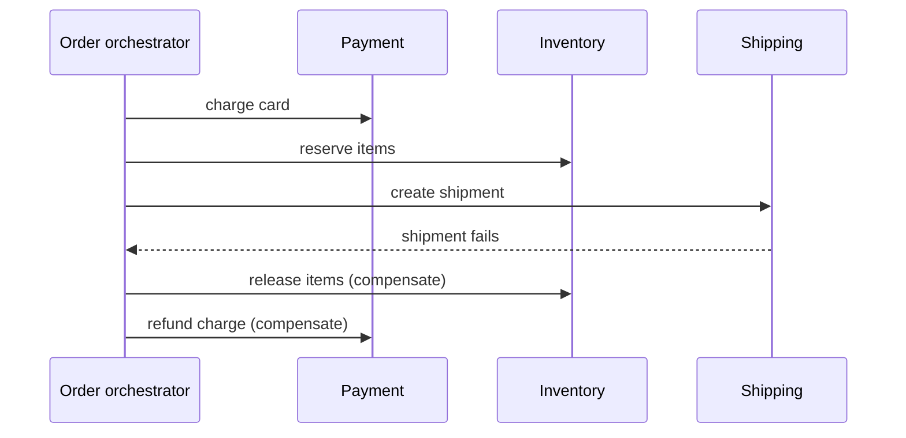

# Distributed transactions: 2PC vs sagas

> Keep one logical operation correct when it spans services that each own their own database.

## What it is

"Place an order" really means three writes: charge the payment, reserve the inventory, create the shipment. In a microservice system each write lives in a different service with its own database, so no single database transaction covers all three. There are two families of answers: make the operation atomic anyway (two-phase commit) or turn it into a sequence of steps you can undo (a saga).

## Two-phase commit (2PC)

A coordinator asks every participant to **prepare**: take locks and promise the write will succeed. When every participant votes yes, the coordinator tells them all to **commit**. This gives true atomicity, but it blocks: participants hold their locks while waiting for the decision, and a dead coordinator leaves every participant frozen with locks held. That is why 2PC lives inside tightly controlled database systems like [Spanner](../deep-dives/spanner-global-sql.md), and almost never between microservices: one slow or crashed service would stall the payment database for everyone.

## Saga

A saga breaks the operation into a chain of local transactions, one per service, each committing immediately. If a later step fails, the earlier steps are undone by a **compensating action** (an explicit reverse operation): refund the charge, release the inventory. Between steps the system is visibly in a half-finished state (the charge exists, the shipment does not yet), so eventual consistency is the price.

## Choreography vs orchestration

There are two ways to drive the chain. In **choreography**, each service publishes an event to a [message queue](message-queues.md) and the next service reacts; there is no coordinator, but the flow is written down nowhere, so debugging means reading five codebases. In **orchestration**, one orchestrator service calls each step and decides what happens on failure: one place to read the flow, one component to keep alive and durable. Once a chain passes about three steps, pick orchestration.

## What sagas require

Every step will eventually be retried after a timeout or a crash, so every step must be [idempotent](idempotency.md) (safe to run twice). And "commit the local transaction, then publish the event" must never lose the event, which is exactly the problem the [outbox pattern](outbox-pattern.md) solves. Systems that already record every change as an event ([event sourcing](event-sourcing-cqrs.md)) get the saga's audit trail almost for free.

## Trade-offs

| | Two-phase commit | Saga |
|---|---|---|
| Consistency | Atomic: all steps or none | Eventual: half-finished states are visible |
| Availability | Blocking: locks held while waiting | Each step commits and moves on |
| Coupling | Tight: every participant joins one protocol | Loose: services connected by events or an orchestrator |
| Cost | Coordinator failure freezes participants | Compensation logic is real code you must write and test |
| Hard limit | Rarely viable across services | Some actions cannot be compensated: you cannot un-send an email |

## How to talk about it in an interview

The senior answer starts by trying to remove the problem: redesign the service boundary so the whole transaction fits inside one service and one database. A distributed transaction is the fallback, not the default. If it is truly unavoidable, say "saga with an orchestrator" and name each compensating action out loud. A [payment system](../questions/design-payment-system.md) is the classic question where this trade-off decides the design.

## Go deeper

- Related deep dive: [Spanner](../deep-dives/spanner-global-sql.md), the system that made 2PC work at global scale
- Every pattern, in depth: [System Design Patterns](https://www.designgurus.io/course/system-design-patterns?utm_source=github&utm_medium=repo&utm_campaign=grokking-system-design&utm_content=patterns-distributed-transactions)
- Full course: [Grokking the System Design Interview](https://www.designgurus.io/course/grokking-the-system-design-interview?utm_source=github&utm_medium=repo&utm_campaign=grokking-system-design&utm_content=patterns-distributed-transactions)
