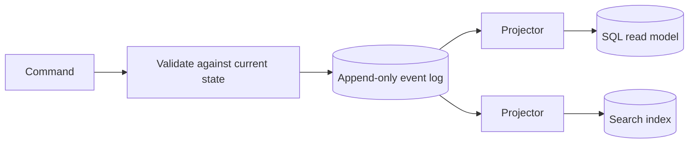

# Event sourcing and CQRS

> Store what happened as the source of truth, and build every view you need by replaying it.

## What it is

Most systems store current state: balance = 70. Event sourcing stores the facts instead: deposited 100, withdrew 30. The facts live in an append-only event log, and state is the result of folding the events (applying them in order, from the start). CQRS (command query responsibility segregation) is the natural partner: commands append events on the write side, and projectors (consumers that fold events into a view) maintain read models shaped for each query.

## How it works

A command arrives, say "withdraw 30". The write side validates it against current state, then appends one event. The write is a single append: fast and auditable, the same idea as a [write-ahead log](write-ahead-log.md) one level up, except here the log is the product, not an implementation detail. Projectors consume the stream, often through a [message queue](message-queues.md) or [Kafka](../deep-dives/kafka-distributed-messaging.md), and update read models: a SQL table, a cache, a search index. Each query gets exactly the shape it wants.

## When to use it

- Audit is a requirement. In a [payment system](../questions/design-payment-system.md), the ledger already is an event log; event sourcing just names the practice.
- Temporal questions. "What did the cart look like on Tuesday" is a replay up to that moment.
- Many differently shaped read views over the same writes.
- A stream is already the backbone of the system, so the log costs you nothing new.

## When not to use it

Plain CRUD (create, read, update, delete) with one view. The costs are real:

- Read-after-write lag: projections update after the command, so a user may not see their own write immediately.
- Event schema evolution forever: old events never go away, so every replayer must understand every historical version.
- Replay time on rebuild: folding millions of events is slow. Snapshots fix this: persist the folded state every N events, then replay only from the last snapshot.

## Trade-offs

| Pro | Con |
|-----|-----|
| Complete audit trail built in; the log is the truth | Read models lag writes (eventual consistency) |
| Each query gets a read model shaped for it | Event schemas must be supported forever |
| Any view can be rebuilt by replaying the log | Rebuilds are slow without snapshots |
| One append per write keeps the write path fast | Many more components to build and operate than CRUD |

## Common variations

- CQRS without event sourcing: a current-state store remains the truth, and change events feed separate read models. This is the most common production shape. The [outbox pattern](outbox-pattern.md) keeps the state write and the published event atomic.
- Snapshots: periodic saved state so recovery and replay start near the present.
- Rebuild as a deploy technique: to change a read model, run a new projector from event zero into a fresh table, then switch reads over.

## How to talk about it in an interview

Reach for it when the interviewer asks for audit trails or "who changed what, and when". Name the lag between command and projection before they do; that shows you have run one. Do not lead with it for a CRUD app: proposing an event log for a simple admin panel reads as buzzword driven.

## Go deeper

- Related deep dive: [Kafka](../deep-dives/kafka-distributed-messaging.md)
- Every pattern, in depth: [System Design Patterns](https://www.designgurus.io/course/system-design-patterns?utm_source=github&utm_medium=repo&utm_campaign=grokking-system-design&utm_content=patterns-event-sourcing-cqrs)
- Full course: [Grokking the System Design Interview](https://www.designgurus.io/course/grokking-the-system-design-interview?utm_source=github&utm_medium=repo&utm_campaign=grokking-system-design&utm_content=patterns-event-sourcing-cqrs)
