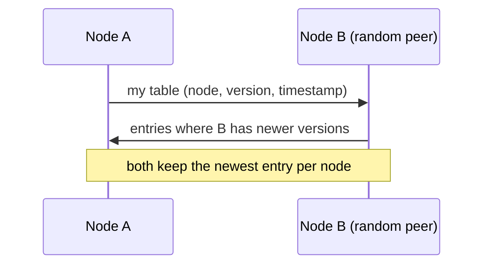

# Gossip protocol

> Nodes learn the state of a large cluster by periodically exchanging what they know with a few random peers.

## What it is

A gossip protocol spreads cluster state without a central registry and without broadcasting to everyone. On a timer (say once per second), each node picks a few random peers and exchanges what it knows: membership, health, versions. Information spreads the way a rumor does: after O(log N) rounds the whole cluster knows, and each node's network cost stays constant no matter how large the cluster grows.

## Why not the alternatives

A central membership service is a single point of failure and a hot spot: every node reports to it, and when it dies nobody knows who is alive. All-to-all [heartbeats](heartbeats.md) (every node pinging every other node) cost N-squared messages per round, which stops scaling at a few hundred nodes. Gossip is the decentralized middle: robust, cheap, and eventually consistent (every node converges to the same view, just not at the same instant).

## How it works

Each node keeps a table with one row per known node: (node id, heartbeat counter or version, last-updated timestamp). Every round, it merges tables with a random peer, keeping the newest entry per node.

Three exchange styles:

- **Push**: send your entries to the peer; simple, but slow to reach the last few uninformed nodes.
- **Pull**: ask the peer for its entries; fast at the end of a rumor's spread, slow at the start.
- **Push-pull**: exchange both ways in one round trip; this is what most real systems use.

## Failure detection

A node whose table entries stop advancing is suspected, then declared dead after a timeout. Good implementations use graded suspicion instead of a single yes-or-no cutoff, so one slow round does not mark a healthy node dead and then alive again (flapping). Phi accrual failure detection is the name to drop: it turns the history of heartbeat arrival times into a continuous suspicion score.

## Where it is used

- [Cassandra](../deep-dives/cassandra-wide-column-db.md) and [Dynamo](../deep-dives/dynamo-key-value-store.md)-style stores gossip membership and ring state (which node owns which key range).
- Consul and Serf use gossip for service discovery and health checks across thousands of machines.
- As the seeding layer under [leader election](leader-election.md): gossip tells you who is alive, election picks who is in charge. They compose, not compete.

## Trade-offs

| Pro | Con |
|-----|-----|
| No coordinator to fail or overload | Eventual: convergence takes O(log N) rounds, not one |
| Constant per-node load at any cluster size | Fanout (peers contacted per round) and interval need tuning |
| Keeps working through network partitions | Brief false suspicions under load or packet loss |

## How to talk about it in an interview

Reach for gossip when asked "how do 1,000 nodes know who is in the cluster?" Answering "heartbeats to a coordinator" at that scale invites the follow-up you just avoided: what happens when the coordinator dies or saturates? Name the mechanism (random peers, merge newest, O(log N) convergence) and the cost (eventual, tunable, occasional false suspicion).

## Go deeper

- Related deep dives: [Cassandra](../deep-dives/cassandra-wide-column-db.md), [Dynamo](../deep-dives/dynamo-key-value-store.md)
- Every pattern, in depth: [System Design Patterns](https://www.designgurus.io/course/system-design-patterns?utm_source=github&utm_medium=repo&utm_campaign=grokking-system-design&utm_content=patterns-gossip-protocol)
- Full course: [Grokking the System Design Interview](https://www.designgurus.io/course/grokking-the-system-design-interview?utm_source=github&utm_medium=repo&utm_campaign=grokking-system-design&utm_content=patterns-gossip-protocol)
