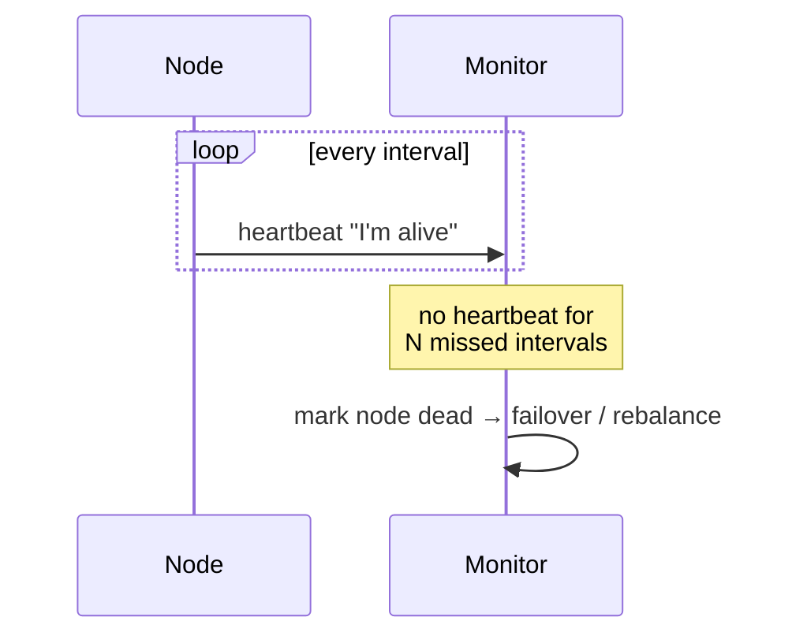

# Heartbeats and failure detection

> Nodes periodically say "I'm alive" so the system can tell a dead server from a slow one and react automatically.



## What it is

In a distributed system you can never directly observe that a remote node is dead; you can only observe that it has stopped talking. A heartbeat is a small periodic message ("still here") sent to a monitor or to peers. Miss enough of them and the node is declared failed, triggering failover, re-replication, or removal from the load balancer pool.

## How it works

```
[Worker] --heartbeat every 2s--> [Coordinator]
Coordinator rule: no heartbeat for 10s (5 missed) => mark dead, reassign work
```

Two common shapes:

- **Centralized**: every node reports to a coordinator or monitoring service (Kubernetes liveness probes, load balancer health checks, GFS chunkservers reporting to the master).
- **Decentralized (gossip)**: nodes exchange heartbeat state with a few random peers each round, and liveness information spreads epidemically. Cassandra and Dynamo-style systems do this to avoid a central monitor.

## The timeout trade-off

The detection timeout is the whole game:

| Timeout | Consequence |
|---------|-------------|
| Too short | Slow-but-alive nodes are declared dead: false positives, needless failovers, flapping |
| Too long | Real failures go unnoticed: requests keep routing to a dead node |

A network partition is indistinguishable from a crash, which is exactly why failover decisions should be paired with [quorum](quorum.md) agreement and fencing (see [leader election](leader-election.md)) rather than taken by a single observer. Adaptive detectors (like the phi accrual detector) adjust the threshold to observed network behavior instead of using a fixed timeout.

## When to use it

- Any pool of servers behind a load balancer (health checks are heartbeats in reverse: the monitor asks, the node answers).
- Cluster membership: who is in the cluster right now, for sharding and rebalancing.
- Detecting a failed leader to trigger a new election.

## How to talk about it in an interview

Whenever you say "if the server fails, we fail over," the interviewer's next question is "how do you know it failed?" Answer with heartbeats plus a concrete policy (interval, missed count), then acknowledge the false-positive risk and how the system stays safe when detection is wrong.

## Go deeper

- Related deep dives: [GFS](../deep-dives/gfs-distributed-file-system.md), [Cassandra](../deep-dives/cassandra-wide-column-db.md)
- Every pattern, in depth: [System Design Patterns](https://www.designgurus.io/course/system-design-patterns)
- Full course: [Grokking the System Design Interview](https://www.designgurus.io/course/grokking-the-system-design-interview)