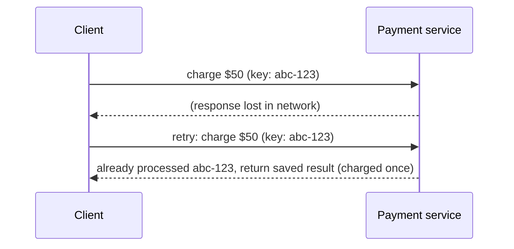

# Idempotency

> Design operations so that doing them twice has the same effect as doing them once, making retries safe.

## What it is

Networks fail in an ambiguous way: when a request times out, the caller cannot know whether the server processed it. The only safe recovery is to retry, and retries are only safe if the operation is idempotent: executing it N times leaves the system in the same state as executing it once. Charging a card, sending an email, and inserting a row are not naturally idempotent; good designs make them so.

## How it works

The standard mechanism is an **idempotency key**: the client generates a unique ID per logical operation and sends it with every attempt. The server records the key with the result of the first execution and replays the stored result for any duplicate.

The key check and the operation must be atomic (a unique constraint in the database, or an atomic set-if-absent), otherwise two concurrent retries can both pass the check.

## Where it matters most

- Payments and orders: Stripe's `Idempotency-Key` header is the canonical example.
- [Message queues](message-queues.md): most deliver at-least-once, so every consumer sees duplicates eventually; consumers must deduplicate or be idempotent.
- Any API called by clients with retry logic, which is every API.

## Techniques

| Technique | How |
|-----------|-----|
| Idempotency keys | Client-supplied unique ID, server dedupes and replays result |
| Natural idempotency | `SET x = 5` instead of `INCREMENT x`; upsert instead of insert |
| Conditional writes | Compare-and-set with a version number; duplicate applies fail cleanly |
| Database constraints | Unique index on a business key turns duplicates into handled errors |

## How to talk about it in an interview

Any time your design includes a retry, a queue, or a payment, say the word "idempotent" and explain the mechanism in one sentence: "the client sends an idempotency key, we store it with the result, duplicates get the stored result." This is one of the highest signal-per-second things you can say in payment and messaging designs.

## Go deeper

- Full question walkthrough: [Design a payment system](../questions/design-payment-system.md)
- Full course: [Grokking the System Design Interview](https://www.designgurus.io/course/grokking-the-system-design-interview)