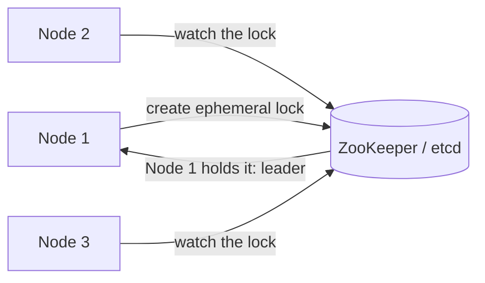

# Leader election (leader and follower)

> Pick one node to be in charge of a task or a data partition, and pick a new one automatically when it fails.

## What it is

Many problems get dramatically simpler when exactly one node makes the decisions: ordering writes to a partition, running a scheduled job exactly once, coordinating a cluster. Leader election is the mechanism by which a group of nodes agrees on who that one node is, and re-agrees when the leader dies.

## How it works

Modern systems rarely implement election from scratch. They either use a consensus protocol directly (Raft, Paxos, ZAB) or lean on a coordination service that already runs one:

Each candidate tries to create the same ephemeral key; whoever succeeds is leader. The key is tied to a session kept alive by [heartbeats](heartbeats.md), so if the leader dies, the key vanishes and the watchers race to elect a successor. Elections require a majority [quorum](quorum.md), which prevents two partitions from each electing their own leader.

## The fencing problem

A leader that is merely slow (long GC pause, network blip) may believe it is still leader after a successor has been elected. The fix is a **fencing token**: a monotonically increasing epoch number issued with each election. Downstream systems reject writes carrying an older epoch, so the deposed leader cannot corrupt anything.

## When to use it

- Single-writer-per-partition databases (Kafka partition leaders, primary replicas).
- "Exactly one node should do this" jobs: cron scheduling, compaction, cluster rebalancing.
- Coordinators in distributed transactions and cluster managers.

## Trade-offs

| Pro | Con |
|-----|-----|
| Simple reasoning: one decision-maker per scope | Leader is a bottleneck and a single point of failure per scope |
| No conflicting concurrent writes | Failover window means brief unavailability |
| Well-supported by off-the-shelf tools (ZooKeeper, etcd) | Split brain if done without quorum and fencing |

## How to talk about it in an interview

Never say "the nodes just agree." Name the tool (ZooKeeper, etcd) or the protocol (Raft), then preempt the classic follow-ups: how do you detect the leader is dead (heartbeats and session timeouts), and what stops a paused old leader from writing (fencing tokens).

## Go deeper

- Related deep dive: [Chubby, Google's distributed lock service](../deep-dives/chubby-distributed-locking.md)
- Every pattern, in depth: [System Design Patterns](https://www.designgurus.io/course/system-design-patterns?utm_source=github&utm_medium=repo&utm_campaign=grokking-system-design&utm_content=patterns-leader-election)
- For harder, distributed-systems depth: [Advanced System Design Interview, Volume II](https://www.designgurus.io/course/grokking-system-design-interview-ii?utm_source=github&utm_medium=repo&utm_campaign=grokking-system-design&utm_content=patterns-leader-election)