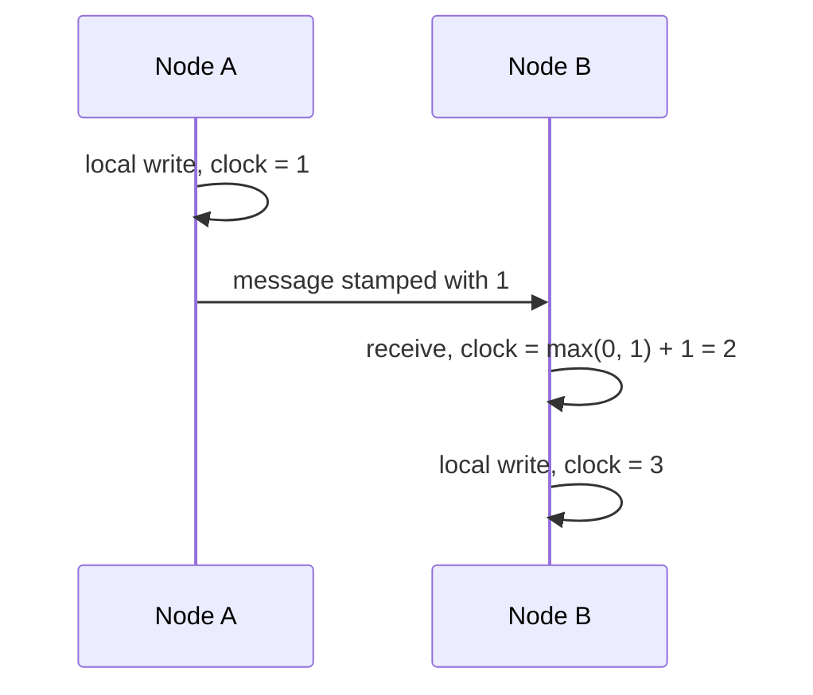

# Logical clocks: Lamport and vector clocks

> Order events across machines with counters, because wall clocks on different servers cannot be trusted to agree.

## The problem

Every machine's clock drifts. NTP (Network Time Protocol, the standard clock sync service) keeps servers roughly in agreement, but "roughly" still means milliseconds of skew (small disagreement between clocks). So when two servers each accept a write, comparing their timestamps cannot tell you which write happened first. Systems that resolve conflicts with "last writer wins by timestamp" silently drop writes whenever the clocks disagree. The expensive exception is Google Spanner, which buys globally trusted time with atomic clocks and GPS receivers ([deep dive](../deep-dives/spanner-global-sql.md)). Everyone else needs a different tool: a logical clock, which replaces wall time with a counter. It does not know what time it is. It only knows what happened before what.

## Lamport clocks

Each node keeps one integer counter:

- Increment it on every local event.
- Stamp every outgoing message with the current value.
- On receiving a message, set the counter to max(local, received) + 1.

The guarantee runs one way only: if event A caused event B, then clock(A) < clock(B). The reverse does not hold. A smaller clock value does not prove the event happened first. Break ties by node id and you get a consistent total order (every node sorts events the same way), which is useful for ordering log entries. What a Lamport clock cannot do is detect that two events were concurrent, meaning neither one could have known about the other.

## Vector clocks

A vector clock keeps one counter per node, so each node carries a vector like {A: 2, B: 5, C: 1}. Comparing two vectors answers the question Lamport clocks cannot:

- If one vector is less than or equal to the other in every slot, that event happened before.
- If each vector is ahead of the other somewhere, the events were concurrent.

Detecting concurrency is the point. Instead of guessing which of two conflicting writes to keep, the system knows they were a true conflict and can keep both versions, then merge them.

## Where you meet them

Dynamo-style stores ([deep dive](../deep-dives/dynamo-key-value-store.md)) version each object with a vector clock, so a [shopping cart](../questions/design-amazon-shopping-cart.md) written on both sides of a network partition merges instead of losing items. Multi-leader [replication](replication.md) uses the same idea to detect conflicting writes, and what you do with a detected conflict is really a choice among [consistency models](consistency-models.md).

## Trade-offs

| Lamport clock | Vector clock |
|---------------|--------------|
| One integer, tiny to store and send | One counter per writer, so size grows with the number of writers |
| Gives a total order with a node id tiebreak | Detects concurrency, so true conflicts are found instead of guessed |
| Cannot detect concurrent events | Needs pruning, or the vectors bloat over time |

Many production systems retreat from vector clocks to last-writer-wins for simplicity and accept the occasional lost update. DynamoDB does exactly this.

## How to talk about it in an interview

The moment your design has two places that accept writes, expect the question "how do you know which version is newer?" Answering "compare timestamps" is the trap. The escape is either vector clocks (detect the conflict, then merge or surface it) or restructuring so each key has a single writer. Naming that choice out loud is the signal interviewers listen for.

## Go deeper

- Related deep dives: [Dynamo](../deep-dives/dynamo-key-value-store.md), [Spanner](../deep-dives/spanner-global-sql.md)
- Every pattern, in depth: [System Design Patterns](https://www.designgurus.io/course/system-design-patterns)
- Full course: [Grokking the System Design Interview](https://www.designgurus.io/course/grokking-the-system-design-interview)
