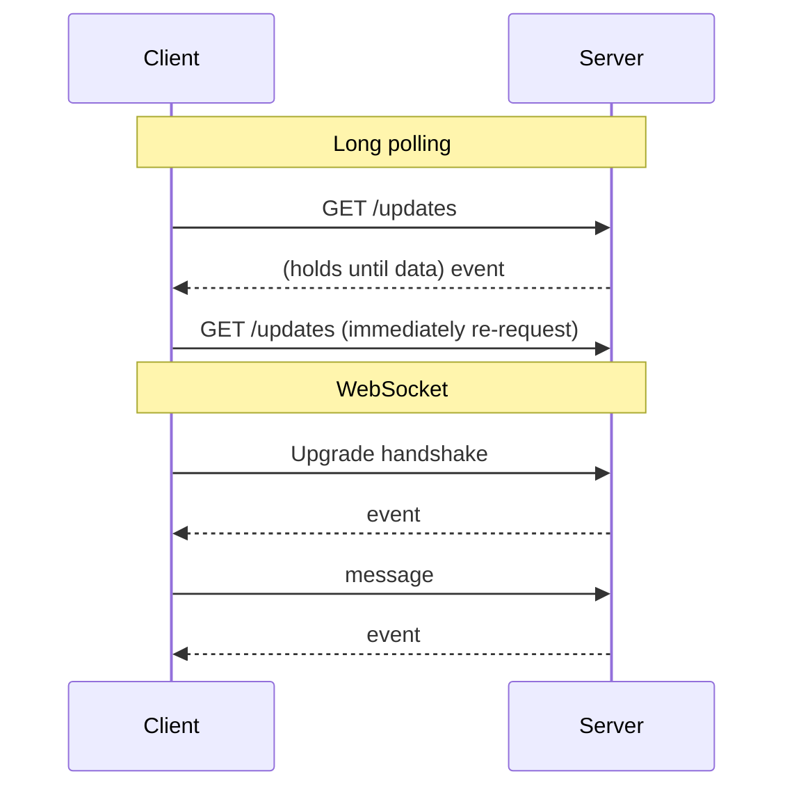

# Long polling vs WebSockets vs Server-Sent Events

> Three ways to push real-time updates from server to client, from "good enough" to fully bidirectional.

## The problem

Plain HTTP is request-response: the server cannot start a conversation. Chat apps, live feeds, notifications, and collaborative editors all need the server to deliver updates the moment they happen. These three techniques close that gap.

## The options

| Technique | How it works | Direction | Best for |
|-----------|--------------|-----------|----------|
| Short polling | Client asks "anything new?" every N seconds | Client pull | Rarely; simple but wasteful |
| Long polling | Client asks; server holds the request open until there is data, then the client immediately re-asks | Server push (simulated) | Modest update rates, maximum compatibility |
| Server-Sent Events (SSE) | One long-lived HTTP connection; server streams events down it | Server to client only | Feeds, notifications, live scores, LLM token streaming |
| WebSockets | HTTP connection upgraded to a persistent, full-duplex TCP channel | Both directions | Chat, multiplayer games, collaborative editing, trading |

## How to choose

- Updates flow one way (server to client)? SSE is simpler than WebSockets: plain HTTP, automatic reconnection built in.
- Client also sends frequent messages (chat, games, cursors)? WebSockets.
- Infrequent updates, or strict corporate proxies in the way? Long polling still works everywhere.

## Scaling concerns

Persistent connections change the math: a server that handles thousands of requests per second may only hold tens of thousands of open connections. You need connection-aware load balancing (sticky sessions or a connection gateway tier), heartbeats to detect dead connections, and a plan for reconnect storms after a deploy or outage. A [message queue](message-queues.md) or pub/sub layer usually fans events out to whichever gateway node holds each user's connection.

## How to talk about it in an interview

State the requirement first ("clients need updates within a second, and they also send messages, so WebSockets"), then mention the operational cost of persistent connections. Choosing SSE when the flow is one-directional is a strong senior signal; defaulting to WebSockets for everything is a common junior mistake.

## Go deeper

- Full course: [Grokking the System Design Interview](https://www.designgurus.io/course/grokking-the-system-design-interview)
- Practice live: [Mock interviews](https://www.designgurus.io/mock-interviews)