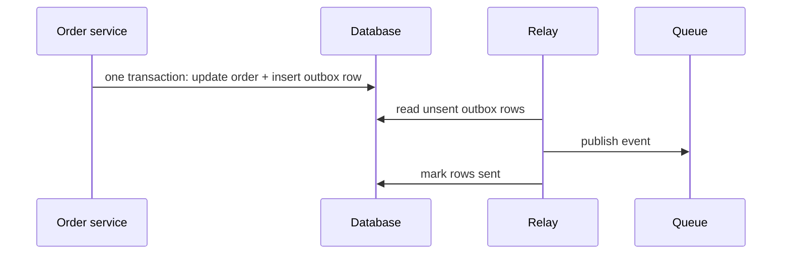

# Outbox pattern

> Publish events reliably by writing them to your own database first, then letting a relay push them out.

## What it is

A service often has to do two things for one action: update its database and publish an event to a [message queue](message-queues.md). No transaction covers both systems. Crash between the two writes and you get one of two bad outcomes: the state changed but no event went out (downstream services never learn about it), or the event went out for a change that rolled back. This is called the dual-write problem. The outbox pattern removes the second write entirely: the event is stored in your own database, inside the same transaction as the state change.

## How it works

In the same local database transaction that changes state, insert the event as a row in an outbox table (a plain table holding events waiting to be published). A separate relay process reads unsent rows, publishes them to the queue, and marks them sent. The transaction guarantees the state change and the event are recorded together or not at all. The relay guarantees the event eventually goes out.

Delivery is at-least-once: the relay can crash after publishing but before marking a row sent, and it will publish that row again on restart. So consumers must be [idempotent](idempotency.md), meaning they handle the same event twice without a double effect. The consumer-side twin is an inbox table: store each processed event id and skip any id you have already seen.

## Trade-offs

| Pro | Con |
|-----|-----|
| State and event are consistent, guaranteed by one local transaction | An extra table and a relay process to build and operate |
| No distributed transaction across the database and the queue | Events publish with a small lag, not instantly |
| Works with any database that supports transactions | At-least-once delivery means duplicates; consumers must dedupe |

## Common variations

- **Polling publisher**: the relay runs a query for unsent rows every second or so. Simple to build, adds a little lag, and the polling itself puts some load on the database.
- **Change data capture (CDC)**: the relay tails the database's own [write-ahead log](write-ahead-log.md) and turns committed outbox inserts into events. No polling, lower lag, and it is the production-grade choice. Debezium is the tool name to drop.

## How to talk about it in an interview

Whenever your design says "update the database and emit an event", expect the follow-up: "what happens if it crashes between those two?" The outbox is the expected answer. It is also what makes [sagas and other distributed transactions](distributed-transactions.md) workable, since every saga step depends on its event reliably going out. Order events in a [food delivery system](../questions/design-food-delivery.md) are a natural place to bring it up.

## Go deeper

- Related pattern: [Event sourcing and CQRS](event-sourcing-cqrs.md)
- Every pattern, in depth: [System Design Patterns](https://www.designgurus.io/course/system-design-patterns?utm_source=github&utm_medium=repo&utm_campaign=grokking-system-design&utm_content=patterns-outbox-pattern)
- Full course: [Grokking the System Design Interview](https://www.designgurus.io/course/grokking-the-system-design-interview?utm_source=github&utm_medium=repo&utm_campaign=grokking-system-design&utm_content=patterns-outbox-pattern)
