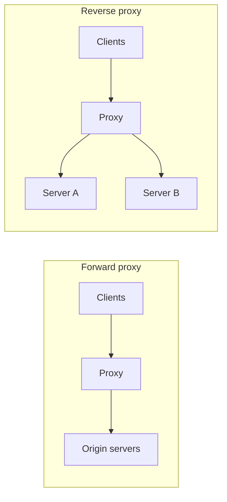

# Proxies

> An intermediary server that sits between clients and servers, used for routing, security, caching, and hiding topology.

## What it is

A proxy accepts requests on behalf of someone else. A **forward proxy** sits in front of clients and represents them to the outside world (the server sees the proxy, not the client). A **reverse proxy** sits in front of servers and represents them to clients (the client sees the proxy, not the individual servers). Almost every large system has a reverse proxy at its front door.

## When to use it

- Forward proxy: enforcing egress policy, anonymizing clients, caching outbound requests (corporate networks, crawlers).
- Reverse proxy: TLS termination, compression, caching, request routing, hiding the server fleet, and a single place to apply security rules.

## Forward vs reverse at a glance

| | Forward proxy | Reverse proxy |
|---|---------------|---------------|
| Acts on behalf of | The client | The server |
| Who is hidden | The client's identity | The server topology |
| Typical uses | Egress filtering, anonymity, client-side caching | TLS termination, load balancing, caching, WAF |
| Examples | Squid, corporate proxies | Nginx, HAProxy, Envoy, Cloudflare |

## Relationship to other building blocks

A load balancer is a reverse proxy specialized for distributing traffic (see [load balancing](load-balancing.md)). An [API gateway](api-gateway.md) is a reverse proxy specialized for API concerns like auth and rate limiting. A [CDN](cdn.md) edge server is a caching reverse proxy deployed globally.

## Trade-offs

| Pro | Con |
|-----|-----|
| Central place for cross-cutting concerns (TLS, caching, security) | Extra network hop adds latency |
| Hides and decouples internal topology | Single point of failure if not replicated |
| Servers can change without clients noticing | One more component to operate and monitor |

## How to talk about it in an interview

Most candidates draw a reverse proxy without naming it. Naming it, and knowing that load balancers, API gateways, and CDN edges are all specialized reverse proxies, signals that you understand the layer rather than just the boxes. Expect the follow-up: "what is the difference between a forward and a reverse proxy?"

## Go deeper

- Every pattern, in depth: [System Design Patterns](https://www.designgurus.io/course/system-design-patterns)
- Full course: [Grokking the System Design Interview](https://www.designgurus.io/course/grokking-the-system-design-interview)