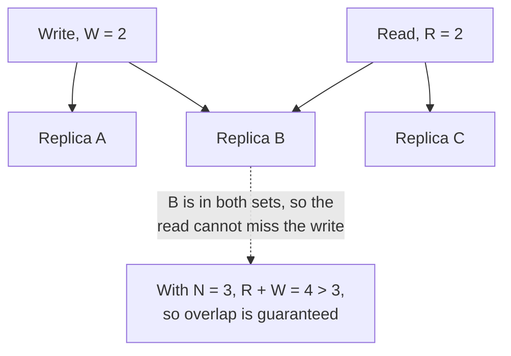

# Quorum

> Require a minimum number of replicas to agree before a read or write counts, so the system stays correct when some nodes are down.

## What it is

With N replicas of a piece of data, a quorum system requires W replicas to acknowledge a write and R replicas to answer a read. If **R + W > N**, every read set overlaps every write set by at least one node, so a read always sees the latest acknowledged write. This is how leaderless stores like Dynamo and Cassandra offer tunable consistency.

## How it works

Typical setup, N = 3, W = 2, R = 2:

```
Write "x=5" --> [Replica A: ack] [Replica B: ack] [Replica C: slow, ignored]
Read "x"    --> [Replica B: x=5] [Replica C: x=old]  --> newest version wins
```

The read touches at least one replica (B) that saw the write, and version numbers or timestamps pick the newest value.

## Tuning R and W

The rule is not arbitrary. R plus W greater than N is exactly the condition that forces the two sets to share a replica:



| Configuration | Effect |
|---------------|--------|
| W = N, R = 1 | Fast reads, slow and fragile writes |
| W = 1, R = N | Fast writes, slow reads |
| W = 2, R = 2 (N = 3) | Balanced; the common default |
| R + W <= N | No overlap guarantee: eventual consistency, but lower latency |

Majority quorums (more than N/2) also prevent split brain: two partitions cannot both hold a majority, which is why consensus systems (Raft, Paxos, ZooKeeper) elect leaders and commit entries with majority votes.

## When to use it

- Leaderless or multi-leader replication where you still want read-your-writes behavior.
- Any coordination task where two halves of a partitioned cluster must not both proceed (see [leader election](leader-election.md)).

## Trade-offs

| Pro | Con |
|-----|-----|
| Tunable consistency vs latency per operation | Latency set by the slowest node in the quorum |
| Tolerates node failures without losing correctness | R + W > N still is not full linearizability under sloppy quorums or concurrent writes |
| No single leader bottleneck | Requires versioning and conflict resolution (vector clocks, last-write-wins) |

## How to talk about it in an interview

Give the formula (R + W > N) and one concrete configuration. Then show judgment: "for this feature, stale reads are acceptable, so I would drop R to 1 for latency." Connecting quorums to majority-based leader election and split-brain prevention is a strong senior signal.

## Go deeper

- Related deep dives: [Dynamo](../deep-dives/dynamo-key-value-store.md), [Cassandra](../deep-dives/cassandra-wide-column-db.md)
- Every pattern, in depth: [System Design Patterns](https://www.designgurus.io/course/system-design-patterns?utm_source=github&utm_medium=repo&utm_campaign=grokking-system-design&utm_content=patterns-quorum)
- For harder, distributed-systems depth: [Advanced System Design Interview, Volume II](https://www.designgurus.io/course/grokking-system-design-interview-ii?utm_source=github&utm_medium=repo&utm_campaign=grokking-system-design&utm_content=patterns-quorum)