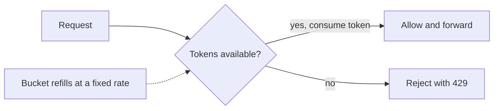

# Rate limiting

> Cap how many requests a client can make in a time window, to protect a service from overload and abuse.

## Why it matters

Rate limiting defends against traffic spikes, abusive clients, and runaway costs. It keeps a service available for everyone by refusing or slowing excess traffic, usually returning HTTP 429 (Too Many Requests).

Token bucket, the common default:

## Algorithms

| Algorithm | How it works | Notes |
|-----------|--------------|-------|
| Token bucket | Tokens refill at a fixed rate; each request spends one | Allows short bursts; common default |
| Leaky bucket | Requests drain from a queue at a fixed rate | Smooths output, no bursts |
| Fixed window | Count requests per fixed time window | Simple, but allows bursts at window edges |
| Sliding window log | Track timestamps of recent requests | Accurate, more memory |
| Sliding window counter | Weighted blend of current and previous window | Good accuracy-to-cost balance |

## Distributed rate limiting

A single server's in-memory counter does not work across a fleet. Options: a shared store like Redis holding the counters (watch for the extra round trip and race conditions, use atomic operations), or approximate local limits per node that sum to the global budget.

## Where to apply it

At the API gateway or load balancer (first line of defense), and per service for finer control. Limit by user, API key, or IP depending on the threat.

## How to talk about it in an interview

Pick an algorithm and justify it (token bucket is a safe default for allowing bursts), then address the distributed case: where the counter lives and how you keep it correct under concurrency.

## Go deeper

- Practice live: [Mock interviews](https://www.designgurus.io/mock-interviews)
- Full course: [Grokking the System Design Interview](https://www.designgurus.io/course/grokking-the-system-design-interview)