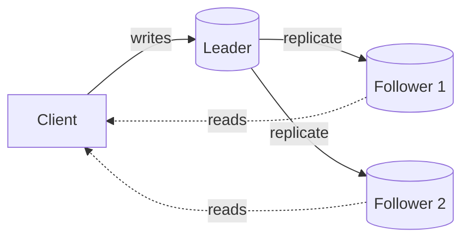

# Replication

> Keep copies of data on multiple nodes so the system stays available when one fails, and so reads can scale.

## What it is

Replication maintains copies (replicas) of the same data on more than one node. It improves availability (if one node dies, others serve the data), durability (the data survives a single failure), and read throughput (reads spread across replicas).

Single-leader replication: writes go to the leader, reads can be served by followers.

## Models

| Model | How it works | Trade-off |
|-------|--------------|-----------|
| Single leader (primary-replica) | Writes go to the leader, replicate to followers | Simple, but the leader is a write bottleneck |
| Multi leader | Several nodes accept writes | Higher write availability, but conflicts to resolve |
| Leaderless (quorum) | Reads and writes hit a quorum of nodes | Tunable consistency, more client complexity |

## Synchronous vs asynchronous

- Synchronous: the write waits until a replica confirms. Safer (no data loss on failover), slower.
- Asynchronous: the write returns immediately and replicates in the background. Faster, but a leader crash can lose the last few writes.
- Semi-synchronous (wait for at least one replica) is a common middle ground.

## Replication lag

Async replicas can fall behind the leader, so a read from a replica may be stale. This is the source of "read your own writes" problems. Mitigations: read from the leader for recent writes, or track a version and wait for the replica to catch up.

## Trade-offs

| Pro | Con |
|-----|-----|
| High availability and read scaling | Replication lag causes stale reads |
| Durability across node failures | Failover and conflict handling add complexity |

## How to talk about it in an interview

Pick a model and justify it, state whether replication is sync or async and why, and address replication lag explicitly (it is a favorite follow-up).

## Go deeper

- Read more (free): [Data Replication Strategies](https://www.designgurus.io/blog/data-replication-strategies-system-design)
- Full course: [Grokking the System Design Interview](https://www.designgurus.io/course/grokking-the-system-design-interview)