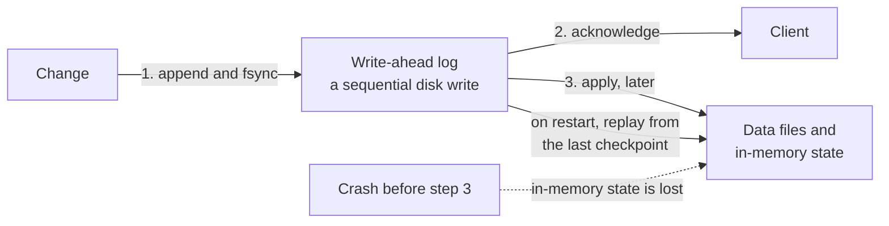

# Write-ahead log (WAL)

> Record every change to an append-only log before applying it, so a crash never loses acknowledged data.

## What it is

Updating data structures in place is fragile: crash mid-update and the structure is corrupt. A write-ahead log flips the order: first append a description of the change to a sequential log and flush it to disk, only then apply the change to the real data structures (which can even sit in memory). After a crash, replay the log and you are back exactly where you were.

## How it works

```
Write path:  change --> append to WAL (sequential disk write, fsync) --> ack client
                                --> apply to in-memory state / data files (later, async)
Recovery:    read WAL from last checkpoint --> replay entries --> state restored
```

Sequential appends are the fastest thing a disk can do, which is why WALs make systems both safer and faster: the client is acknowledged after one sequential write instead of many random ones. Periodic **checkpoints** persist the current state so recovery only replays the log tail, and older log segments can be truncated.

## Where it is used

The client is acknowledged after step 1, not step 3. That is what makes a crash survivable and why the write is fast:



- Every serious database: PostgreSQL's WAL, MySQL's redo log, the memtable-plus-WAL design in LSM stores (Cassandra, RocksDB, [BigTable](../deep-dives/bigtable-wide-column-store.md)).
- [Replication](replication.md): the log of changes is exactly what you ship to replicas (Postgres streaming replication, MySQL binlog).
- [Kafka](../deep-dives/kafka-distributed-messaging.md) generalizes the idea: the log itself is the product, and consumers are just replayers.
- Event sourcing: application state defined as the replay of an event log.

## Trade-offs

| Pro | Con |
|-----|-----|
| Durability: acknowledged writes survive crashes | Every write hits disk twice (log now, data later) |
| Sequential I/O makes writes fast | Log grows without bound unless checkpointed and truncated |
| The log doubles as a replication and audit stream | fsync frequency is a real latency vs durability knob |

## How to talk about it in an interview

Use it whenever an interviewer asks "what happens if the server crashes here?" The one-sentence answer: "changes go to a write-ahead log before being applied, so on restart we replay from the last checkpoint." Connecting the WAL to replication (ship the same log to followers) shows you see the deeper pattern.

## Go deeper

- Related deep dives: [Kafka](../deep-dives/kafka-distributed-messaging.md), [BigTable](../deep-dives/bigtable-wide-column-store.md)
- Every pattern, in depth: [System Design Patterns](https://www.designgurus.io/course/system-design-patterns?utm_source=github&utm_medium=repo&utm_campaign=grokking-system-design&utm_content=patterns-write-ahead-log)
- Full course: [Grokking the System Design Interview](https://www.designgurus.io/course/grokking-the-system-design-interview?utm_source=github&utm_medium=repo&utm_campaign=grokking-system-design&utm_content=patterns-write-ahead-log)