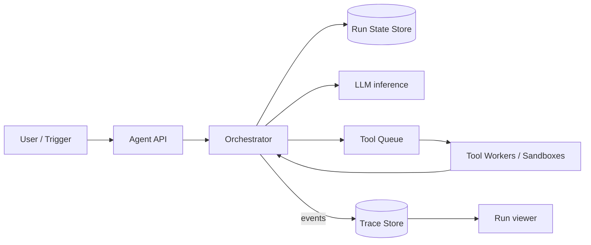

# Design an AI agent orchestration system

> A platform that runs LLM agents: multi-step loops where a model plans, calls tools, observes results, and continues until a task completes.

## 1. Requirements

**Functional**
- Execute agent runs: a loop of LLM call → tool calls → LLM call, possibly for many steps.
- Tools include internal APIs, code execution, web access, each with permissions.
- Runs can be long (minutes to hours), can pause for human approval, and must be resumable.
- Users can inspect a run's full trace: every step, tool call, and token.

**Non-functional**
- Durability: a worker crash must not lose a 40-minute run.
- Isolation: agent code execution cannot touch other tenants or the platform.
- Cost and safety limits per run: token budgets, step caps, tool allowlists.

## 2. The core insight: an agent run is a workflow

The LLM loop looks conversational, but architecturally it is a durable workflow: a sequence of steps whose state must survive crashes, with retries, timeouts, and human-in-the-loop gates. Model it like a workflow engine (checkpointed state machine), not like a chat request. Getting this framing out early is most of the interview.

## 3. Run state and durability

- Persist an event log per run: each LLM request/response and tool call/result is an appended event ([write-ahead log](../patterns/write-ahead-log.md) thinking). Current state is a fold over events, so any worker can resume a run by replaying.
- Checkpoint before side effects: never call a tool before durably recording the intent to call it.
- Tool calls must be [idempotent](../patterns/idempotency.md) or deduplicated with an idempotency key (run id, step number), because at-least-once delivery plus a payments tool is an incident.

## 4. Deep dive: tool execution and isolation

- Declarative tool registry: name, schema, permissions, timeout, rate limits.
- Arbitrary code execution runs in sandboxes (microVMs or gVisor-class containers) with no network by default, CPU/memory/time caps, per-tenant.
- Egress control: agents fetching URLs go through a proxy with allowlists; an agent that can read your wiki and make arbitrary POST requests is an exfiltration machine (prompt injection turns your own agent against you).
- Treat tool results as untrusted input to the model; provenance-tag content fetched from the web.

## 5. Deep dive: scheduling long loops

Do not hold a worker per run: a run that waits 2 hours for human approval would pin a process. Instead, the orchestrator is event-driven: each step is a task; between steps the run is just rows in the state store. Workers are stateless; a [distributed job scheduler](design-distributed-job-scheduler.md) with priority queues drives steps. Timers (step timeout, run deadline, "wake up at 9am") live in a scheduler service.

## 6. Guardrails

- Budgets: max tokens, max steps, max wall time, max tool spend per run; enforced by the orchestrator, not by asking the model nicely.
- Loop detection: an agent alternating between the same two tool calls should trip a breaker ([circuit breaker](../patterns/circuit-breaker.md) applied to behavior).
- Human gates: high-impact tools (send email, spend money) require an approval event before the step executes.

## 7. Bottlenecks and trade-offs

- Context growth: long runs accumulate history beyond the model's window; summarize or truncate older steps, keeping the trace store as full ground truth.
- Trace volume: token-level traces are huge; store hot traces fully, sample or compact old ones.
- Multi-agent (agents spawning sub-agents) is the same design recursively: sub-runs with parent links and inherited budgets.
- Latency vs durability: checkpointing every step adds writes on the hot path; batch trace events, never skip pre-side-effect checkpoints.

## Go deeper

This walkthrough is written for a general system design round. For the AI-round version, which leads with data, evaluation, and cost, see [Design a customer support agent](https://github.com/design-gurus/grokking-ai-system-design/blob/main/questions/design-a-customer-support-agent.md).

- AI system design: [Grokking the AI System Design Interview](https://www.designgurus.io/course/grokking-the-ai-system-design-interview)
- AI foundations: [Grokking Modern AI Fundamentals](https://www.designgurus.io/course/grokking-modern-ai-fundamentals)
- Full course: [Grokking the System Design Interview](https://www.designgurus.io/course/grokking-the-system-design-interview)