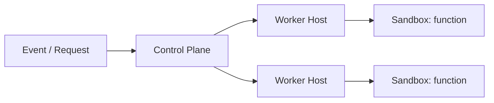

# Design Amazon Lambda (serverless functions)

> A platform that runs user functions on demand, scaling automatically, without users managing servers.

## Requirements

- Run a user's function in response to an event or request.
- Scale from zero to many instances automatically.
- Isolate untrusted code safely.
- Start fast and bill per use.

## Key ideas

- Execution: functions run in isolated sandboxes (containers or microVMs), one per concurrent invocation, with CPU, memory, and time limits.
- Cold vs warm starts: spinning up a new sandbox is slow (cold start), so the platform keeps warm sandboxes pooled and reuses them.
- Scheduling: a control plane places invocations onto worker hosts and scales the pool with demand.
- Isolation is the core challenge, the same concern as a [code judging system](design-code-judging-system.md), but as a general-purpose platform.

## High-level design

## Go deeper

- Quick, focused prep: [System Design Interview Crash Course](https://www.designgurus.io/course/system-design-interview-crash-course)
- Full course: [Grokking the System Design Interview](https://www.designgurus.io/course/grokking-the-system-design-interview)