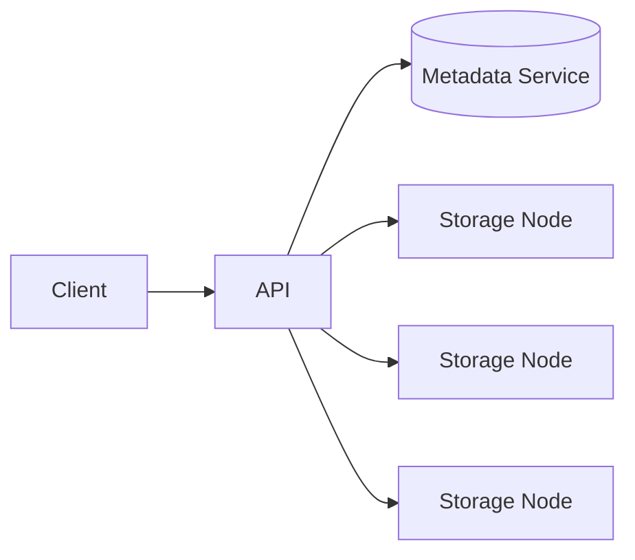

# Design Amazon S3 (object storage)

> A durable, scalable object store: put, get, and delete large blobs by key, with very high durability.

## Requirements

- Store and retrieve objects (files) of any size by key, organized in buckets.
- Extremely high durability and availability.
- Scale to exabytes and many requests.

## Key ideas

- Objects are stored as blobs; metadata (key, size, location, checksum) lives in a separate, indexed metadata service.
- Durability comes from replication or erasure coding across many machines and racks, plus checksums to detect corruption.
- Large objects are split into parts for parallel and resumable uploads.
- Partition the namespace by key so the metadata service scales (see [sharding](../patterns/sharding-partitioning.md)).

## High-level design

## Go deeper

- Quick, focused prep: [System Design Interview Crash Course](https://www.designgurus.io/course/system-design-interview-crash-course)
- Full course: [Grokking the System Design Interview](https://www.designgurus.io/course/grokking-the-system-design-interview)