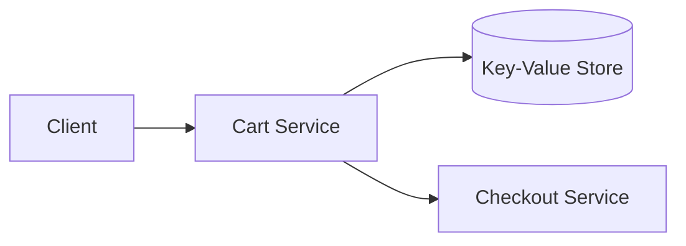

# Design Amazon shopping cart

> A cart that holds items per user, persists across devices and sessions, and feeds into checkout.

## Requirements

- Add, update, and remove items in a cart.
- Persist the cart across sessions and devices.
- Stay available (a cart that will not load loses sales).
- Handle inventory and price at checkout, not in the cart.

## Key ideas

- The cart is a per-user key-value record; availability matters more than strong consistency, so an always-writable store is a good fit (see [Dynamo](../deep-dives/dynamo-key-value-store.md)).
- Merge carts: a guest cart should merge into the account cart on login.
- Keep price and stock checks at checkout; the cart stores item references, not frozen prices.
- Conflicts (the same cart edited on two devices) resolve by merging items.

## High-level design

## Go deeper

- Quick, focused prep: [System Design Interview Crash Course](https://www.designgurus.io/course/system-design-interview-crash-course)
- Full course: [Grokking the System Design Interview](https://www.designgurus.io/course/grokking-the-system-design-interview)