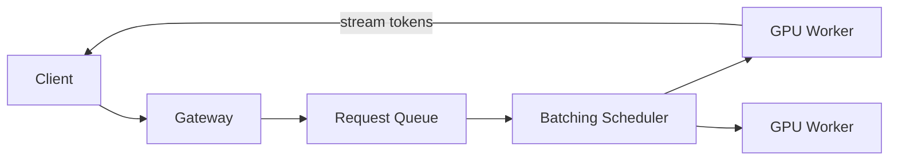

# Design ChatGPT (LLM serving)

> A service that serves a large language model to many users, streaming responses with low latency.

## Requirements

- Accept a prompt and stream back a generated response.
- Serve a large model to many concurrent users.
- Keep latency acceptable and cost under control.
- Maintain conversation context.

## Key ideas

- Inference serving: requests hit a fleet of GPU workers running the model; a scheduler batches concurrent requests together to use the hardware efficiently.
- Streaming: tokens are generated one at a time and streamed to the client over a persistent connection, so the user sees output as it is produced.
- Context: conversation history is sent with each request (within a context limit); long histories may be summarized or truncated.
- Scaling and cost: GPUs are expensive, so batching, queuing, and autoscaling the worker pool are central. Cache common results where possible.

## High-level design

## Go deeper

- Quick, focused prep: [System Design Interview Crash Course](https://www.designgurus.io/course/system-design-interview-crash-course)
- Full course: [Grokking the System Design Interview](https://www.designgurus.io/course/grokking-the-system-design-interview)