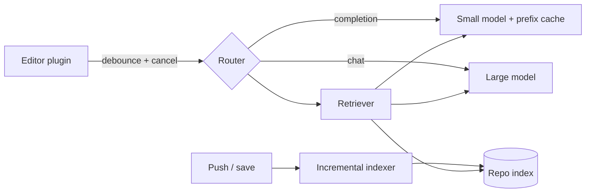

# Design an AI code assistant (Copilot)

> Serve code completions inside the editor at keystroke speed, grounded in the user's own repository.

## 1. Requirements

**Functional**
- Inline completions as the user types (gray text the user accepts with Tab).
- Chat about the open codebase ("explain this function", "write a test for this").
- Suggestions aware of the user's whole repository, not just the open file.

**Non-functional**
- Completions: first visible token in under about 200 ms, because the suggestion competes with the user's own typing.
- Chat: a few seconds is acceptable.
- Code never leaks across customers.
- Cost per active user stays low; a heavy user triggers thousands of requests per day.

## 2. Two workloads, two deployments

Completions and chat share nothing but the model family:

| Workload | Volume | Context | Latency | Model |
|----------|--------|---------|---------|-------|
| Completions | Huge (every pause in typing) | Small | ~200 ms | Small, fast |
| Chat | Low | Large (files, history) | Seconds | Large |

Route between them at the entry point. Serving both from one deployment forces the large model's cost onto the hot path. This split is the organizing decision of the design.

## 3. Completions path

On each pause in typing, the editor plugin builds a prompt from the code before and after the cursor. This is fill-in-the-middle (FIM): the model is trained to write the code that belongs between a given prefix and suffix. Add cheap signals: imports, open tabs, the file path.

Two client behaviors protect the latency budget:
- Debounce: wait a few tens of milliseconds after the last keystroke before sending, so a burst of typing does not fire a request per key.
- Cancel: the moment the user types again, abort the in-flight request. Most requests die before finishing, so the serving tier must make cancellation cheap (stop generating, free the slot) instead of running every request to completion.

## 4. Repo awareness

An indexing pipeline chunks and embeds the repository, the same shape as [semantic search](design-semantic-search.md) and the ingestion half of a [RAG pipeline](design-rag-pipeline.md). At request time, retrieval pulls the most relevant snippets (similar functions, type definitions, sibling files) into the prompt, within a fixed context budget. The index updates incrementally on push or save: re-embed only the changed files.

## 5. Deep dive: prefix caching

Consecutive completion requests share almost the entire prompt: the file so far, plus a few new characters. Prefix caching stores the model's computed state for that shared prefix (the KV cache), so each new request pays only for the new tokens. This [caching](../patterns/caching.md) lives inside the model server, not in front of it. Add continuous batching (new requests join a running batch instead of waiting for it to finish) and each keystroke request becomes cheap. These two techniques are the economics of the product; see [design an LLM inference platform](design-llm-inference-platform.md) for the serving tier itself.

## 6. Quality loop

The metric is acceptance rate: did the user keep the suggestion? Log accept, reject, and edit-after-accept events. This telemetry feeds a [model evaluation pipeline](design-model-evaluation-pipeline.md) that compares prompt variants and model versions offline before any rollout.

## 7. Trust and safety

- Per-tenant isolation: one customer's index is never retrievable by another. Partition indexes by tenant rather than filtering a shared one.
- Secret detection: strip API keys and credentials from prompts before they leave the client, and from completions before they render.
- Optional filter that suppresses suggestions matching public code, for customers with license concerns.

## 8. Bottlenecks and trade-offs

- Bigger context improves suggestions but costs latency and money; the completion path stays small on purpose.
- On-device models remove network latency and privacy risk but cap quality; a hybrid (local model for easy cases, server for hard ones) is a common middle ground.
- Suggestion frequency: aggressive triggering produces more accepted code but annoys users; tune the debounce and add a gate that decides whether to suggest at all.

## High-level design

## Go deeper

This walkthrough is written for a general system design round. For the AI-round version, which leads with data, evaluation, and cost, see [Grokking AI System Design](https://github.com/design-gurus/grokking-ai-system-design).

- AI system design: [Grokking the AI System Design Interview](https://www.designgurus.io/course/grokking-the-ai-system-design-interview?utm_source=github&utm_medium=repo&utm_campaign=grokking-system-design&utm_content=questions-design-code-assistant)
- AI foundations: [Grokking Modern AI Fundamentals](https://www.designgurus.io/course/grokking-modern-ai-fundamentals?utm_source=github&utm_medium=repo&utm_campaign=grokking-system-design&utm_content=questions-design-code-assistant)
- Full course: [Grokking the System Design Interview](https://www.designgurus.io/course/grokking-the-system-design-interview?utm_source=github&utm_medium=repo&utm_campaign=grokking-system-design&utm_content=questions-design-code-assistant)
