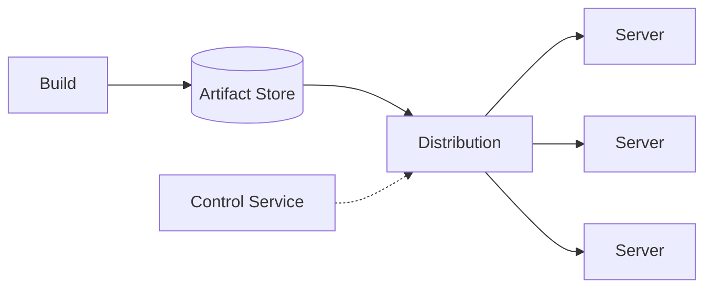

# Design a code deployment system

> Build, distribute, and roll out application binaries to a large fleet of servers safely.

## Requirements

- Build code into a deployable artifact.
- Distribute the artifact to thousands of servers worldwide.
- Roll out gradually and roll back fast on failure.
- Track deployment status.

## Key ideas

- Pipeline: build produces an immutable, versioned artifact stored in an artifact repository (object storage).
- Distribution: pushing a large artifact to thousands of machines is a fan-out problem; use regional mirrors or a peer-to-peer scheme so the source is not a bottleneck.
- Rollout strategy: deploy in stages (canary, then waves) with health checks, and roll back automatically if metrics degrade.
- Status tracking: a control service records which version each server runs.

## High-level design

## Go deeper

- Quick, focused prep: [System Design Interview Crash Course](https://www.designgurus.io/course/system-design-interview-crash-course)
- Full course: [Grokking the System Design Interview](https://www.designgurus.io/course/grokking-the-system-design-interview)