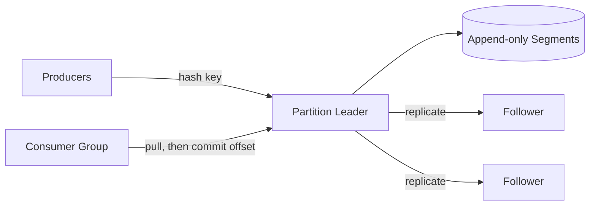

# Design a distributed message queue

> Build the queue itself: durable, ordered, high-throughput delivery of messages from producers to consumers.

Most questions ask you to use a [message queue](../patterns/message-queues.md). This one asks you to build one. The interviewer wants to hear about storage, replication, and delivery guarantees, not about which product you would pick.

## 1. Requirements

**Functional**
- Publish: producers append messages to a named topic.
- Consume and acknowledge: consumers read messages and confirm (ack) each one after processing.
- At-least-once delivery: every message reaches a consumer one or more times; none are silently dropped.
- Ordering within a key: messages that share a key arrive in the order they were sent.
- Optional replay: a consumer can rewind and re-read old messages.

**Non-functional**
- About 1 million messages per second, scaling horizontally by adding nodes.
- No data loss when a node fails.
- A crashed consumer must not lose messages or stall the queue.

## 2. Two models to choose from

| Model | How it works | State kept |
|-------|--------------|------------|
| Visibility-timeout queue (SQS style) | Deliver a message, hide it, redeliver if not acked in time | Per-message state |
| Partitioned log (Kafka style) | Append messages to a log; each consumer tracks its own read position | One offset per consumer per partition |

A visibility timeout hides a delivered message for a set period; if the consumer does not ack in time, the message reappears for redelivery. It is simple, but the broker must track state for every in-flight message. The log needs far less bookkeeping, and replay costs nothing extra because old messages stay on disk until retention deletes them. Build the log; it is the richer interview. The [Kafka deep dive](../deep-dives/kafka-distributed-messaging.md) covers the real system this mirrors, and the [queue comparison cheat sheet](../cheat-sheets/kafka-vs-rabbitmq-vs-sqs.md) contrasts the two models across products.

## 3. Storage: partitions and segments

A topic splits into partitions. A partition is an append-only log on disk: new messages go only at the end. Sequential writes are the reason this is fast; it is the same insight behind the [write-ahead log](../patterns/write-ahead-log.md). Each partition is stored as a series of segment files, with a small index that maps an offset (a message's position number in the partition) to its byte location in the file. Retention deletes whole old segments by age or by total size.

## 4. Ordering and partitioning

Hash each message's key to pick its partition. All messages with the same key land in the same partition, so their order holds. Across partitions there is no ordering guarantee. Say this plainly. Also say that adding partitions changes the hash mapping: new messages for a key may go to a different partition than its old ones, so choose the partition count early or accept a brief ordering break when you expand.

## 5. Deep dive: replication

Each partition has one leader and a few followers on other nodes ([replication](../patterns/replication.md)). Producers choose an acknowledgment level:

- Leader-only ack: fast, but the newest messages are lost if the leader fails before followers copy them.
- All in-sync replicas: the leader waits until every caught-up follower has the message. Durable, but slower.

An in-sync replica is a follower whose copy is fully caught up with the leader. When the leader fails, [leader election](../patterns/leader-election.md) must promote a follower from the in-sync set only; promoting a lagging follower silently discards the tail of the log.

## 6. Deep dive: delivery semantics

Consumers form consumer groups: the partitions of a topic are divided among the members of a group, and each member commits (saves) the offset it has processed up to.

- Commit before processing: a crash after the commit loses that message. This is at-most-once.
- Commit after processing: a crash before the commit causes redelivery. This is at-least-once, with duplicates.

Choose commit-after, and make consumers [idempotent](../patterns/idempotency.md): processing the same message twice must have the same effect as processing it once. Exactly-once delivery is not a separate mechanism; it is at-least-once plus deduplication on the consumer side. Say it that plainly.

## 7. Bottlenecks and trade-offs

- Partition count: more partitions give more consumer parallelism, but also more metadata to manage and slower rebalances when a consumer joins or leaves a group.
- fsync policy: fsync forces buffered data from memory to physical disk. Fsync on every message and latency suffers; fsync in batches and a power loss can drop the last few messages, so you rely on replication to cover that gap.
- Head-of-line blocking: within one partition, a slow message delays every message behind it. More partitions reduce the blast radius.
- Lagging consumers: the log absorbs a backlog on disk, but you still need [backpressure](../patterns/backpressure.md) signals so producers slow down before retention deletes unread messages.

## High-level design

## Go deeper

- Full course: [Grokking the System Design Interview](https://www.designgurus.io/course/grokking-the-system-design-interview?utm_source=github&utm_medium=repo&utm_campaign=grokking-system-design&utm_content=questions-design-distributed-message-queue)
