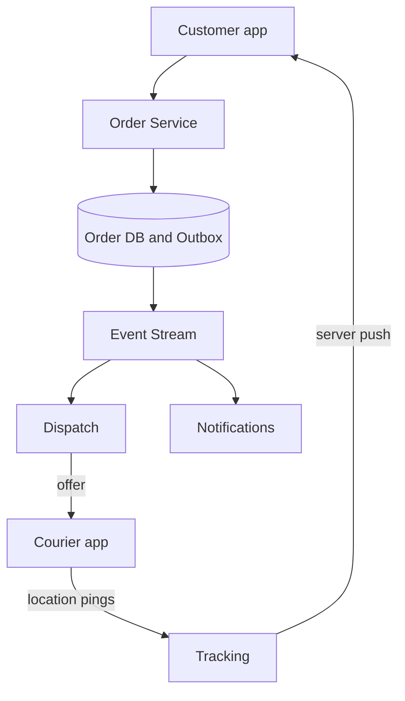

# Design a food delivery app (DoorDash)

> A three-sided marketplace: customers order, restaurants cook, couriers deliver, and the system keeps all three in sync.

## 1. Requirements

**Functional**
- Browse nearby restaurants and their menus.
- Place an order and pay.
- The restaurant accepts the order and preps the food.
- A courier is dispatched, picks up the food, and delivers it.
- The customer tracks the courier live, and everyone sees an ETA (estimated time of arrival).

**Non-functional**
- An accepted order is never lost. Its state must survive any crash.
- Tracking updates reach the customer within a few seconds.
- Traffic spikes hard at lunch and dinner; the system must absorb those peaks.

## 2. Estimation

Around 10M orders per day, concentrated in two meal windows. That puts peak order traffic near 500 orders per second, several times the daily average. Courier location updates dominate the write load: with every active courier reporting every few seconds, expect about 1M location updates per second at peak. Orders are small and precious; location pings are huge in volume and individually disposable. Design each path for its own shape.

## 3. The organizing idea: the order is a state machine

A state machine is a model where the order is always in exactly one named state, and only specific transitions between states are allowed. The states: created, paid, accepted, preparing, ready, picked up, delivering, delivered, plus cancel paths out of most of them.

Every transition is an event appended to a [message stream](../patterns/message-queues.md). Downstream services (notifications, dispatch, tracking, payouts) subscribe to the stream instead of calling each other. The order service does not know who cares about "ready"; it just publishes the fact. This keeps the three sides in sync without a web of direct calls. The paid transition itself is its own problem; see [design a payment system](design-payment-system.md).

## 4. Restaurant discovery

Finding open restaurants near the customer is a geospatial search problem: index restaurants by location, query by radius, then rank by distance, prep time, and rating. This is the same core as the [proximity service](design-proximity-service.md) question, so reuse that design rather than rebuilding it here.

## 5. Deep dive: dispatch

Dispatch matches orders that will be ready soon to couriers. The naive approach assigns the nearest free courier the moment a restaurant accepts. That is greedy and one-at-a-time, and during a rush it strands couriers on bad matches.

Instead, batch: every few seconds, collect the ready-soon orders and free couriers in a zone, and solve one assignment that minimizes total courier travel plus total food wait. Send the chosen courier an offer with a timeout. On decline or timeout, cascade to the next best courier.

The target is alignment: the food-ready time and the courier-arrival time should land together. Food that sits goes cold; a courier who waits is wasted supply. That alignment is exactly the ETA problem: predict prep time per restaurant (from history and the current order queue) and drive time per courier, and match on the sum. The matching core is a sibling of [design Uber](design-uber.md); the extra twist here is the prep-time clock.

## 6. Deep dive: reliability of transitions

State transitions must survive crashes and retries.

- Make every transition handler [idempotent](../patterns/idempotency.md): applying the same event twice changes nothing. Key each transition by order id plus event id.
- Enforce legality: reject "delivered" for an order still in "preparing". Illegal transitions signal a duplicated or out-of-order event.
- Publish through an [outbox](../patterns/outbox-pattern.md): write the state change and the outgoing event in one database transaction, and let a relay publish from the outbox table. The database and the stream can never disagree about what happened.

## 7. Live tracking

The courier app streams its location every few seconds. Ingest these pings through a lightweight gateway into an in-memory store keyed by courier; do not push each one through the durable order stream. Customers subscribe to their order and receive updates over server push; see [WebSockets vs SSE vs long polling](../cheat-sheets/websockets-vs-sse-vs-long-polling.md) for the transport choice. Downsample on the way out: the customer needs a smooth dot, not every raw GPS ping.

## 8. Bottlenecks and trade-offs

- Marketplace balance: at peak, courier supply is the constraint. Surge incentives (extra pay per delivery) pull couriers in, at the cost of margin.
- Cancellation compensation: each state has a different refund path. Before accept, full refund; after pickup, the restaurant and courier still get paid. Model cancels as first-class transitions, never as deletes.
- Cold-start ETAs: a new restaurant has no prep-time history. Fall back to cuisine-level averages and promise a wider window until real data accumulates.

## High-level design

## Go deeper

- Full course: [Grokking the System Design Interview](https://www.designgurus.io/course/grokking-the-system-design-interview?utm_source=github&utm_medium=repo&utm_campaign=grokking-system-design&utm_content=questions-design-food-delivery)
