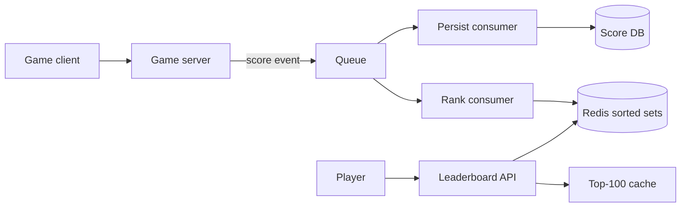

# Design a real-time gaming leaderboard

> Rank tens of millions of players by score, update the ranking after every match, and read the top of the board cheaply.

## 1. Requirements

**Functional**
- Submit a score after each match.
- Read the top N players (the global board).
- Read a player's own rank plus a few neighbors above and below.
- Time-boxed boards: daily, weekly, and all-time.
- Friends-only view of the board.

**Non-functional**
- A new score is visible in the ranking within a second.
- Peak write rate around 50k score updates per second.
- Top-N reads are the hot path (the most frequent operation), so they must be cheap.

## 2. Estimation

50M monthly players, about 10M daily. At 10 matches per player per day, that is 100M score writes per day: roughly 1,200 per second on average, and about 50k per second at peak. A board member is a user id plus a score, tens of bytes. Even 500M members fit in tens of GB of memory.

## 3. Core design: a sorted set per board

The canonical answer is a Redis sorted set, and you should name it as such. A sorted set is an in-memory structure that keeps members ordered by a numeric score, with rank queries in logarithmic time.

- `ZINCRBY board delta user_id` adds match points to a player's total.
- `ZREVRANGE board 0 9 WITHSCORES` returns the top 10.
- `ZREVRANK board user_id` returns the player's rank; a small range query around that rank returns the neighbors.

Daily and weekly boards are separate keys, one key per period. Each carries a TTL (time to live, an expiry timer), so old boards delete themselves. The friends view stays small: fetch the friend list, read each friend's score with `ZSCORE`, and sort the few results in the service. If asked why Redis and not Memcached, the answer is the data structure itself; see the [Redis vs Memcached cheat sheet](../cheat-sheets/redis-vs-memcached.md).

## 4. Durability: Redis is not the source of truth

Redis can lose recent writes on failover. So treat every match result as an event on a [message queue](../patterns/message-queues.md). One consumer applies the score to the sorted set. A second consumer persists it to the database. If a sorted set is lost, rebuild it by replaying scores from the database. The queue also absorbs the peak write bursts.

## 5. Deep dive: rank at huge scale

A single sorted set with 500M members strains one node: memory pressure plus a single-threaded command stream. [Shard](../patterns/sharding-partitioning.md) the set:

- Shard by user id: top-N stays cheap (take the top N from each shard and merge), but exact global rank for a mid-board player requires counting across every shard.
- Shard by score range: rank is the count of players in higher ranges plus your rank within your range, but hot score ranges need rebalancing.

Interviewers accept approximate rank for mid-board players:

- Bucketed histogram: keep a count per score bucket. Rank is the sum of higher buckets, accurate to about 0.1 percent.
- Tiered leagues, the way real games do it: players compete in small leagues of about 50, so exact rank only matters inside a league, and the global board only shows the top tier.

## 6. Cheating

Never accept a raw score from the client. The game server computes the score from the match result and signs the event. An anomaly detector flags impossible deltas, such as a jump larger than a perfect match could produce, for review before they reach the board.

## 7. Bottlenecks and trade-offs

- Real-time vs periodic recompute: a batch job that rebuilds the board every few minutes is simpler and cheaper, but it breaks the rank-within-a-second requirement.
- Memory: every extra time-boxed board is another full copy of the member set. TTLs cap the growth.
- Everyone reads the same top 100. [Cache](../patterns/caching.md) it with a few seconds of staleness, so millions of reads never touch the sorted set. This is the read-side counterpart of the write-side hot key in the [YouTube likes counter](design-youtube-likes-counter.md); counters are the sibling problem.

## High-level design

## Go deeper

- Full course: [Grokking the System Design Interview](https://www.designgurus.io/course/grokking-the-system-design-interview?utm_source=github&utm_medium=repo&utm_campaign=grokking-system-design&utm_content=questions-design-gaming-leaderboard)
- Related: [Design the YouTube likes counter](design-youtube-likes-counter.md)
