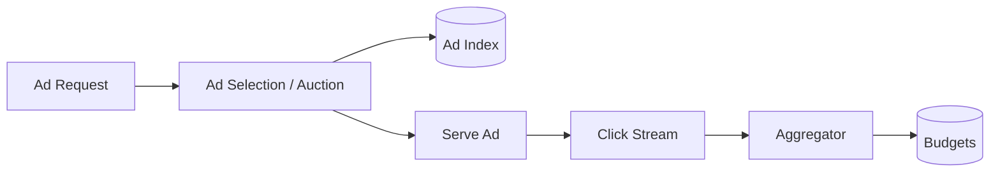

# Design Google Ads

> An ad platform that selects and serves ads, tracks clicks, and bills advertisers accurately.

## Requirements

- Serve relevant ads for a query or page within tight latency.
- Track impressions and clicks at huge scale.
- Bill advertisers correctly (budgets, no overspend).
- Prevent click fraud.

## Key ideas

- Ad selection: match candidate ads (by keyword or targeting), run an auction (ranking by bid and quality), and return the winners within milliseconds.
- Click and impression tracking is a high-volume event pipeline; aggregate through a stream (see the [ad click aggregator](design-ad-click-aggregator.md)).
- Budgets: decrement advertiser budgets accurately so they are not overspent; this is a consistency-sensitive counter.
- Fraud detection runs on the click stream to filter invalid clicks before billing.

## High-level design

## Go deeper

- Quick, focused prep: [System Design Interview Crash Course](https://www.designgurus.io/course/system-design-interview-crash-course)
- Full course: [Grokking the System Design Interview](https://www.designgurus.io/course/grokking-the-system-design-interview)