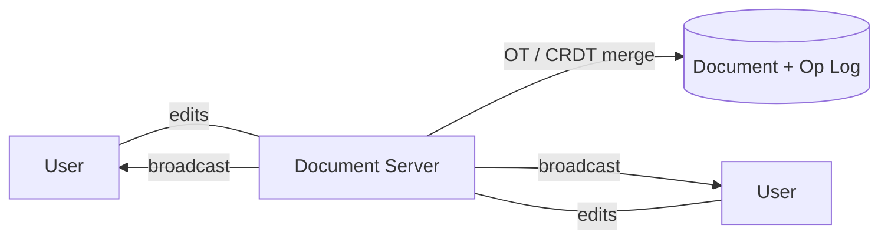

# Design Google Docs

> A collaborative document editor where many people edit the same document at once and see changes live.

## Requirements

- Real-time collaborative editing with live updates.
- Converge to the same document for all editors.
- Persist documents and support offline edits that sync later.
- Presence and cursors.

## Key ideas

- The hard problem is concurrent editing: two people typing at once must merge without losing or corrupting text.
- Two well-known approaches: operational transformation (transform each edit against concurrent ones) and CRDTs (data structures that merge automatically). Both give eventual convergence.
- Architecture: clients send small operations to a document server that orders them, applies the merge strategy, and broadcasts the result to all editors.
- Persistence: store the document plus an operation log so edits can replay and offline changes can sync.

## High-level design

## Go deeper

- Quick, focused prep: [System Design Interview Crash Course](https://www.designgurus.io/course/system-design-interview-crash-course)
- Full course: [Grokking the System Design Interview](https://www.designgurus.io/course/grokking-the-system-design-interview)