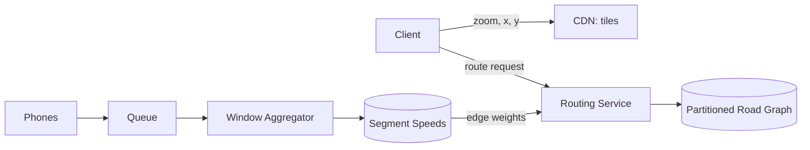

# Design Google Maps

> Serve the map, compute routes, and estimate arrival times for a billion users.

## 1. Scope it first

This question is huge, so the first interview move is to split it and get agreement. There are three subsystems:

1. **Map tiles**: draw the map as the user pans and zooms.
2. **Routing**: compute directions between two points.
3. **Traffic and ETA**: estimate arrival time (ETA) using live road speeds.

Each has a different shape: tiles are a static-content problem, routing is a graph problem, and traffic is a stream-processing problem. Say this out loud, then design each one.

## 2. Requirements

**Functional**
- Pan and zoom a map of the world.
- Get driving directions between two points.
- Show an ETA that reflects current traffic.

**Non-functional**
- Tiles must feel instant, so serve them from edge caches.
- A route request should return in under a second.
- Location ingestion at millions of writes per second.

## 3. Map tiles

Do not render the map per request. Pre-render the whole world into tiles: small square images (or data blobs) at about 20 zoom levels, addressed by (zoom, x, y). Tiles are immutable and versioned, so a [CDN](../patterns/cdn.md) can cache them close to users indefinitely; a map update just publishes a new version. The client computes which tiles are visible and fetches only those.

Modern clients prefer vector tiles: instead of images, the tile carries the raw geometry (roads, labels, buildings) and the client draws it. Payloads shrink, and the client can restyle (dark mode, traffic overlay) without new tiles.

## 4. Routing

Model the road network as a graph: intersections are nodes, road segments are edges, and each edge has a weight (travel time). Plain Dijkstra (the textbook shortest-path algorithm) explores millions of nodes for a cross-country query, far too slow for a sub-second answer.

The fix is precomputation. Hierarchical routing exploits how people actually drive: local streets to a highway, highways for the long middle, local streets at the end. Highways form a much smaller overlay graph, so long queries mostly run on that small graph. Contraction hierarchies is the standard technique: it precomputes shortcut edges that stand in for long chains of road segments, so the query skips them in one hop. [Partition](../patterns/sharding-partitioning.md) the graph by geographic region so each routing server holds a region plus the overlay.

## 5. Traffic and ETA

Phones using navigation report anonymized location and speed every few seconds. A stream pipeline aggregates these reports per road segment in sliding windows (for example, average speed over the last few minutes). Live speeds alone are not enough: blend them with historical patterns per time-of-day, so a segment with no recent reports still gets a sensible weight. These blended weights update edge costs, which update routes and ETAs. The ingestion side looks a lot like [Uber's](design-uber.md) driver-location firehose, and nearby-search over places is its own question: see the [proximity service](design-proximity-service.md).

## 6. Deep dive: the ingestion path

- The phone batches a few seconds of GPS points before sending, cutting request volume by an order of magnitude.
- Reports land in a [message queue](../patterns/message-queues.md), which absorbs rush-hour spikes and lets aggregators fall behind briefly without dropping data.
- Stream jobs do the per-segment window aggregation for live traffic; batch jobs over the same data build the historical time-of-day model. This is the classic [batch vs stream](../patterns/batch-vs-stream-processing.md) hybrid: stream for freshness, batch for depth.
- Privacy is a design requirement, not an afterthought: strip identifiers before aggregation, keep only per-segment statistics, and never store raw location traces keyed by user.

## 7. Bottlenecks and trade-offs

- **Precompute vs freshness**: contraction hierarchies take hours to build, but a road closure must take effect in minutes. Common answer: rebuild rarely, and layer live weight changes on top, accepting slightly worse routes until the next rebuild.
- **Tile storage vs rendering**: pre-rendering every zoom level costs petabytes; rendering on demand saves storage but risks latency. Pre-render busy areas, render remote ones lazily and cache.
- **ETA accuracy vs compute**: richer models (weather, incidents, per-lane data) improve ETAs but multiply the cost of every edge-weight update. Spend the compute on busy segments.

## High-level design

## Go deeper

- Related: [Design Uber](design-uber.md)
- Full course: [Grokking the System Design Interview](https://www.designgurus.io/course/grokking-the-system-design-interview)
