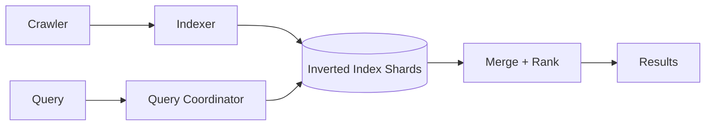

# Design Google Search

> Crawl the web, build an index, and return ranked results for a query within milliseconds.

## Requirements

- Crawl and refresh a huge corpus of web pages.
- Index content for fast lookup.
- Return relevant, ranked results quickly.
- Scale to enormous query volume.

## Key ideas

- Three stages: crawling (see the [web crawler](design-web-crawler.md)), indexing, and serving.
- Inverted index: map each term to the list of documents containing it (see [database indexing](../patterns/database-indexing.md)). The index is sharded across many machines.
- Query serving: a query fans out to index shards, each returns top matches, and results are merged and ranked, all within tight latency.
- Ranking combines relevance signals and authority; precompute what you can and cache popular queries.

## High-level design

## Go deeper

- Quick, focused prep: [System Design Interview Crash Course](https://www.designgurus.io/course/system-design-interview-crash-course)
- Full course: [Grokking the System Design Interview](https://www.designgurus.io/course/grokking-the-system-design-interview)