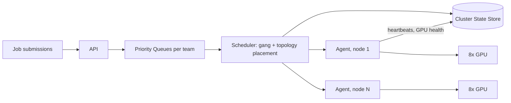

# Design a GPU cluster scheduler

> The system that decides which ML jobs run on which GPUs: thousands of accelerators, training jobs that need hundreds of them at once, and inference that cannot wait.

## 1. Requirements

**Functional**
- Users submit jobs: training (needs N GPUs for hours or days), inference (long-running services), batch (evals, data processing).
- Gang scheduling: a distributed training job needs all N GPUs simultaneously or none.
- Quotas and priorities per team; preemption of lower-priority work.
- Handle node failures: detect, reschedule, let training resume from checkpoints.

**Non-functional**
- Utilization is the metric that matters: idle GPUs are the most expensive idle resource in the company.
- Scheduling decisions in seconds, even with thousands of nodes and queued jobs.
- Fairness: one team cannot starve others.

## 2. Why generic schedulers fall short

Name the three properties that make GPU scheduling its own problem:

1. Gang requirement: a 256-GPU training job cannot start with 255. Piecemeal allocation deadlocks two half-scheduled jobs. You need all-or-nothing placement.
2. Topology sensitivity: training performance depends on interconnect. 8 GPUs on one node (NVLink) beat 8 across nodes; multi-node jobs want the same high-bandwidth network island. Placement quality is performance, not cosmetics.
3. Long-running, stateful jobs: a training job holds resources for days and losing it wastes days, so preemption must cooperate with checkpointing.

## 3. High-level design

- Node agents report inventory and health via [heartbeats](../patterns/heartbeats.md).
- Cluster state lives in a consistent store; the scheduler is the single writer for placements ([leader election](../patterns/leader-election.md) for scheduler failover).
- Queues per team with quotas; the scheduler loops: pick the highest-priority feasible job, find a placement, commit atomically.

## 4. Deep dive: gang scheduling without deadlock

Two 200-GPU jobs each holding 150 GPUs on a 300-GPU cluster is a deadlock. Approaches:

- All-or-nothing commit: the scheduler reserves the full gang in one atomic transaction against cluster state, or not at all.
- Backfill: while a big job waits for its full gang, smaller jobs run in the gaps, but only if they will finish before the reservation matures (use job time estimates), otherwise the big job starves.
- Defragmentation: over time, small jobs scatter across network islands; the scheduler may migrate (checkpoint and move) jobs to open contiguous blocks for large gangs.

## 5. Deep dive: preemption and failure recovery

- Preemption is a protocol, not a kill: signal the job, give it a checkpoint window, then reclaim. Training frameworks checkpoint to blob storage; on resume, the job restarts from the last checkpoint on a new placement.
- Failure math at scale: with thousands of GPUs, hardware faults are routine; a 512-GPU job's mean time between failures is hours. Checkpoint frequency is a trade-off: too rare loses work, too often burns throughput (checkpoint time x frequency is pure overhead).
- Health checking beyond liveness: GPUs fail partially (ECC errors, thermal throttling, a flaky NVLink). Agents run active GPU diagnostics and the scheduler cordons suspect nodes.

## 6. Inference vs training on one fleet

- Inference is latency-sensitive and bursty; training is throughput-hungry and steady. Static partitioning wastes capacity in both directions.
- Common answer: priority tiers with harvest semantics. Inference owns guaranteed capacity; training runs on the remainder plus can be preempted from harvested capacity when inference scales up.
- Quota model: teams get guaranteed minimums, opportunistic capacity above that is preemptible (the Borg idea, see [how the big schedulers work](../deep-dives/README.md)).

## 7. Bottlenecks and trade-offs

- Scheduler throughput: with a big backlog, placement search per job must be bounded; use scoring heuristics, not exhaustive search.
- Utilization vs fairness: perfect fairness fragments the cluster; batching large-gang placements raises utilization but delays small jobs.
- Quota rigidity vs sharing: hard quotas idle GPUs; full sharing invites starvation. Guaranteed-plus-preemptible is the standard compromise.
- Observability: per-job GPU utilization matters as much as allocation; an allocated-but-idle GPU is invisible waste without it.

## Go deeper

- AI foundations: [Grokking Modern AI Fundamentals](https://www.designgurus.io/course/grokking-modern-ai-fundamentals)
- Full course: [Grokking the System Design Interview](https://www.designgurus.io/course/grokking-the-system-design-interview)