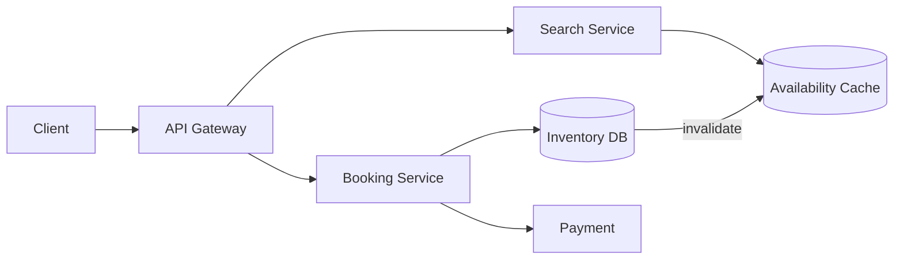

# Design a hotel reservation system

> Search rooms by city and dates, then book without double-booking, across a date range, at chain scale.

## 1. Requirements

**Functional**
- Search hotels by city, date range, and number of guests.
- Show availability and price per room type.
- Reserve a room type for a stay; modify or cancel later.

**Non-functional**
- Never sell more rooms than policy allows.
- Search is read-heavy and can be slightly stale.
- Booking is strongly consistent: the final check must see the true count.

## 2. The key insight: counted, not identified

In [Ticketmaster](design-ticketmaster.md), every seat is a distinct item, so you hold seat 12F. Hotel inventory is different. You do not book room 412; you book one "king room" for each night of the stay. Inventory is a count per (hotel, room type, date). A 3-night stay touches three date rows. This one modeling decision shapes everything below.

## 3. Estimation

500k hotels, about 10 room types each, and a rolling 2-year window of dates gives roughly 3.6 billion inventory rows. The rows are small, so a sharded relational database holds them comfortably. Bookings run a few hundred per second; search traffic is far higher. See the [estimation cheat sheet](../cheat-sheets/estimation.md).

## 4. Data model

- `hotels`: id, name, city, location.
- `room_types`: hotel_id, type, price rules, `total_inventory`.
- `room_inventory`: (hotel_id, room_type_id, date), `total`, `reserved`.
- `reservations`: id, hotel_id, room_type_id, guest, date range, status.

A booking must update several rows atomically (all of them or none), which points at SQL ([SQL vs NoSQL](../cheat-sheets/sql-vs-nosql.md)). A 3-night stay increments `reserved` on three date rows in one transaction.

## 5. Deep dive: booking without double-booking

For each night of the stay, run a conditional update inside a single transaction:

```sql
UPDATE room_inventory
SET reserved = reserved + 1
WHERE hotel_id = ? AND room_type_id = ? AND date = ?
  AND reserved < total;
```

If any night's update matches zero rows, that night is full. Roll back the whole transaction and tell the guest. This is optimistic concurrency: assume the write will succeed, and let the WHERE clause verify it. At a few hundred bookings per second, conflicts are rare, so this beats holding row locks.

Overbooking is a business policy, not a bug. Hotels expect some cancellations, so the condition becomes `reserved < total * overbook_factor`, with the factor set per hotel.

## 6. Search reads vs booking writes

Availability search never needs the transactional store. Serve it from a [cache](../patterns/caching.md) or read replica keyed by city, dates, and room type. Stale results are fine because the booking transaction makes the final check. This is a light form of [CQRS](../patterns/event-sourcing-cqrs.md): a separate read model for search, one write path for bookings. A successful booking invalidates the cached counts for the affected hotel and dates.

## 7. Retries and holds

- The client sends an [idempotency key](../patterns/idempotency.md) with each booking request, so a retry after a timeout cannot create two reservations.
- While payment completes, keep the reservation in a pending state with an expiry. If payment fails or the timer fires, a cleanup job releases the counts.

## 8. Bottlenecks and trade-offs

- Hot rows: one popular hotel on one weekend concentrates writes on a few inventory rows. The conditional update keeps each conflict cheap, and brief queueing on those rows is acceptable at this write rate.
- Sharding: shard by hotel_id. A booking never spans hotels, so every transaction stays on one shard.
- Cache invalidation is the price of fast search. A missed invalidation only shows a stale count; the booking check still protects correctness.

[Airbnb](design-airbnb.md) has the same availability-by-date shape, except each listing is an inventory of exactly one.

## High-level design



## Go deeper

- Related: [Design Ticketmaster](design-ticketmaster.md) covers identified inventory, the other half of this pairing.
- Full course: [Grokking the System Design Interview](https://www.designgurus.io/course/grokking-the-system-design-interview?utm_source=github&utm_medium=repo&utm_campaign=grokking-system-design&utm_content=questions-design-hotel-reservation)
