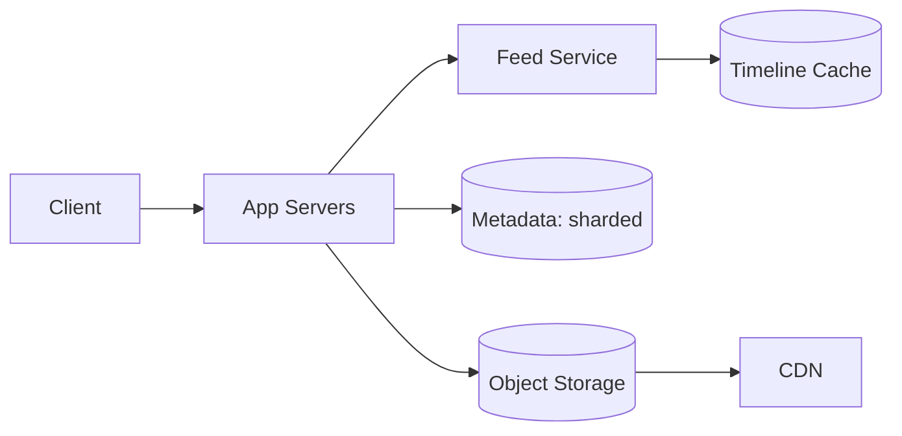

# Design Instagram

> A photo-sharing service where users post images, follow others, and see a feed of posts from people they follow.

## 1. Requirements

**Functional**
- Upload and view photos.
- Follow and unfollow users.
- See a feed of recent posts from followed users.

**Non-functional**
- Read-heavy (viewing vastly outnumbers posting).
- Low-latency feed.
- High availability; eventual consistency is acceptable for the feed.

## 2. Estimation

Assume 500 million users, 2 million new photos per day. Reads dominate at perhaps 100 to 1. Photo storage is the big cost: 2 million per day times an average size adds up to petabytes over years, so store blobs in object storage, not the database.

See the [estimation cheat sheet](../cheat-sheets/estimation.md).

## 3. API

- `POST /photos` with the image and caption.
- `GET /feed` returns a page of posts for the current user.
- `POST /follow` and `DELETE /follow` for the social graph.

## 4. Data model

- Users, Photos (metadata only; the image lives in object storage), and a Follows graph.
- Photo metadata fits a partitioned store keyed by photo id or user id. The image bytes go to object storage fronted by a [CDN](../patterns/cdn.md).

## 5. Feed generation: the key decision

| Approach | How | Best for |
|----------|-----|----------|
| Fan-out on write (push) | When you post, write the post id into each follower's feed | Most users; fast reads |
| Fan-out on read (pull) | Build the feed at read time from who you follow | Celebrities with millions of followers |
| Hybrid | Push for normal users, pull for celebrities | Real systems; avoids the celebrity write storm |

The hybrid approach is the strong answer: pushing to a celebrity's tens of millions of followers on every post is too expensive, so pull their posts at read time and merge.

## 6. Deep dive

- Storage: images in object storage, served via [CDN](../patterns/cdn.md); metadata in a partitioned store.
- Caching: hot feeds and timelines in a cache (see [caching](../patterns/caching.md)).
- Sharding: partition photos and the graph by user id (see [sharding](../patterns/sharding-partitioning.md)).

## 7. Bottlenecks and trade-offs

- The celebrity fan-out problem, solved by the hybrid model.
- Feed freshness vs cost: eventual consistency keeps it cheap.
- Read scaling via caching and [replication](../patterns/replication.md).

## High-level design

## Go deeper

- Read more (free): [How to Design Instagram](https://www.designgurus.io/blog/how-to-design-instagram-in-system-design-interview)
- Full course: [Grokking the System Design Interview](https://www.designgurus.io/course/grokking-the-system-design-interview)