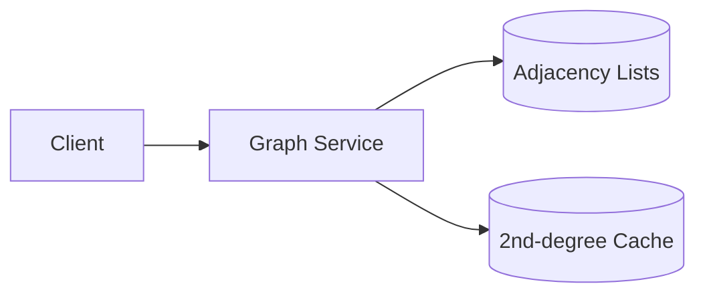

# Design LinkedIn connections

> A professional social graph with connection requests, degrees of connection, and the people graph.

## Requirements

- Send, accept, and remove connection requests.
- Show degree of connection (1st, 2nd, 3rd).
- Compute mutual connections.
- Scale to a very large graph.

## Key ideas

- Model connections as an undirected graph: each accepted connection is an edge between two users.
- Degree of connection is a shortest-path-distance problem; computing it live across hops is expensive, so precompute and cache second-degree networks.
- Mutual connections are an intersection of two users' connection sets; keep adjacency lists in a fast store.
- Partition the graph by user id; cross-partition traversals are the scaling challenge (related to [people you may know](design-people-you-may-know.md)).

## High-level design

## Go deeper

- Quick, focused prep: [System Design Interview Crash Course](https://www.designgurus.io/course/system-design-interview-crash-course)
- Full course: [Grokking the System Design Interview](https://www.designgurus.io/course/grokking-the-system-design-interview)