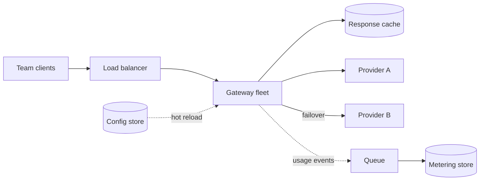

# Design an LLM gateway

> One API in front of every model provider: routing, quotas, caching, failover, and a cost meter for every team.

When every team calls model providers directly, API keys spread across dozens of codebases. Nobody can see total spend. There is no failover. Provider rate limits go to whoever asks first. A gateway fixes this by becoming the single control point for all model traffic. It is the [API gateway pattern](../patterns/api-gateway.md) specialized for LLM calls.

## 1. Requirements

**Functional**
- One unified chat/completions API for all teams.
- Route each request to a provider by model name or by capability.
- Per-team quotas and budgets, with a clear rejection when exceeded.
- Streaming passthrough for token-by-token responses.
- Fall back to another provider when one fails.
- Log every call: tokens, cost, latency, team, and model.

**Non-functional**
- Adds under about 50 ms of latency on the request path.
- Survives any single provider outage.
- Metering and logging never block the hot path.

## 2. High-level architecture

Three parts, kept apart on purpose:

- A stateless gateway fleet behind a load balancer. Any instance can serve any request, so scaling out is simple.
- A config store holding routes, provider keys, and quota rules. Gateways hot-reload it (pick up changes without restarting).
- An async logging pipeline: the gateway emits a usage event to a queue, and a consumer writes it to an analytics store. The response returns before the event is processed, so metering cost never appears in request latency.

## 3. Routing and failover

A route maps a requested model (or a capability such as "cheap summarization") to an ordered chain of upstream providers. Two common rules:

- Explicit pin: the team asked for one exact model, so send it there.
- Cheapest fit: pick the cheapest model that meets the declared capability.

Each upstream provider gets its own [circuit breaker](../patterns/circuit-breaker.md), so a provider that starts timing out is skipped quickly instead of being retried by every request. Retry only on clearly retryable errors, such as a 429 or a connection reset. Timeouts deserve extra care: a timed-out request may still have generated tokens, and the provider may still bill you for them. Failing over after a timeout can mean paying twice for one answer.

## 4. Streaming

Responses stream as server-sent events (SSE), a one-way HTTP stream of small chunks; see the [WebSockets vs SSE vs long polling cheat sheet](../cheat-sheets/websockets-vs-sse-vs-long-polling.md). The gateway passes chunks through untouched while counting tokens as they pass, for metering. Mid-stream failover is not realistic: once the client has received tokens from one model, a different model cannot continue that answer. Fail over before the first token or not at all.

## 5. Quotas are token budgets

A request count is the wrong unit. One request can cost 100 tokens or 100,000. So quotas meter tokens, and through token prices, dollars. The catch: true usage is only known after the response finishes. The fix is a three-step ledger:

1. Estimate: count the prompt tokens, then add the maximum output the request allows.
2. Reserve: subtract the estimate from the team's budget atomically.
3. Settle: after the response, replace the estimate with actual usage.

This is the [rate limiting pattern](../patterns/rate-limiting.md) with a settle step added. It stops one team's runaway script from spending every team's budget.

## 6. Caching

Two layers with very different risk:

- Exact-match cache: keyed on (model, parameters, prompt hash). Safe only for deterministic calls, where the same input always produces the same output (temperature zero). Normal [caching](../patterns/caching.md) rules apply.
- Semantic cache: serve a stored answer for a near-duplicate prompt, matched by embedding similarity. It saves real money, and it risks returning a wrong answer. Offer it per route, off by default.

## 7. Bottlenecks and trade-offs

- The gateway is a single point of failure for every AI feature in the company. It must be the most boring, most replicated service you run.
- Central control vs team autonomy: every new model or parameter a team wants now goes through the gateway's config.
- Logging prompts helps debugging and abuse review, but it also concentrates sensitive data in one place. Decide retention and redaction rules early.
- The gateway routes traffic; it does not serve models. See [design an LLM inference platform](design-llm-inference-platform.md) for the serving side, and [design ChatGPT](design-chatgpt.md) for the product built on top.

## High-level design

## Go deeper

This walkthrough is written for a general system design round. For the AI-round version, which leads with data, evaluation, and cost, see [the token cost math](https://github.com/design-gurus/grokking-ai-system-design/blob/main/cheat-sheets/ai-numbers.md).

- AI system design: [Grokking the AI System Design Interview](https://www.designgurus.io/course/grokking-the-ai-system-design-interview)
- AI foundations: [Grokking Modern AI Fundamentals](https://www.designgurus.io/course/grokking-modern-ai-fundamentals)
- Full course: [Grokking the System Design Interview](https://www.designgurus.io/course/grokking-the-system-design-interview)
