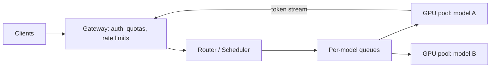

# Design an LLM inference platform

> The serving layer behind a ChatGPT-style product: run large models on GPU fleets, stream tokens to millions of users, and keep cost per request sane.

This goes deeper than [Design ChatGPT](design-chatgpt.md), which covers the product; this covers the platform underneath.

## 1. Requirements

**Functional**
- Serve completion/chat requests against one or more hosted models.
- Stream tokens as they are generated.
- Support multiple tenants with quotas and priorities.

**Non-functional**
- Time to first token (TTFT) under ~1 s; steady inter-token latency after that.
- High GPU utilization (the fleet is the cost).
- Graceful behavior under overload: queue, shed, or degrade, never collapse.

## 2. What makes LLM serving different

State your mental model early, it frames everything:

- Generation is autoregressive: one forward pass per output token, so a 500-token answer is 500 sequential passes. Latency scales with output length.
- Two phases with different shapes: prefill (process the whole prompt, compute-bound, parallel) and decode (one token at a time, memory-bandwidth-bound).
- The KV cache (attention state per sequence) is large, grows with context length, and pins a request to the GPU where its cache lives. Requests are stateful and sticky.

## 3. High-level design

- Gateway: auth, [rate limiting](../patterns/rate-limiting.md) per tenant, request validation.
- Router: picks a GPU pool by model, balances by real load (queue depth, KV-cache free space), not round robin.
- Workers: run the inference engine with continuous batching.
- Streaming back to clients over SSE or WebSockets ([long polling vs WebSockets vs SSE](../patterns/long-polling-websockets-sse.md)).

## 4. Deep dive: continuous batching

Naive batching waits to fill a batch, then runs it to completion; short requests wait for the longest one. Continuous (in-flight) batching admits and retires requests at token granularity: every decode step, finished sequences leave the batch and queued ones join. This is the single biggest utilization lever and the deep dive interviewers most want to hear.

Paged KV-cache management (vLLM-style) allocates cache in fixed-size blocks rather than contiguous slabs, cutting fragmentation and letting you pack more concurrent sequences per GPU.

## 5. Deep dive: overload and fairness

- Admission control at the gateway: per-tenant token budgets, priority tiers.
- Queue per model with deadline-aware scheduling; shed lowest-priority work first when queues grow.
- Backpressure signal: KV-cache occupancy is the real capacity metric, not requests per second.
- Preemption: a long generation can be paused (cache offloaded) to let latency-sensitive traffic through, at the cost of a TTFT hit when resumed.

## 6. Multi-model and big models

- Models that fit one GPU: replicate per GPU, scale horizontally.
- Models bigger than one GPU: tensor parallelism inside a node, pipeline parallelism across nodes; a request now occupies a gang of GPUs, so scheduling is gang scheduling.
- Cold starts are minutes (weights are tens to hundreds of GB), so autoscaling must be predictive, and you keep warm pools per model.

## 7. Bottlenecks and trade-offs

- Utilization vs latency: bigger batches raise throughput and inter-token latency together; pick a batch ceiling per latency tier.
- Prefill vs decode interference: long prompts stall decode steps for everyone in the batch; some platforms split prefill and decode onto separate pools.
- Prefix caching: shared system prompts across requests can reuse KV cache; big win for agent and template workloads.
- Quantization (8-bit, 4-bit) trades a little quality for large memory and throughput gains.

## Go deeper

This walkthrough is written for a general system design round. For the AI-round version, which leads with data, evaluation, and cost, see [continuous batching and the KV cache](https://github.com/design-gurus/grokking-ai-system-design/blob/main/building-blocks/continuous-batching-and-kv-cache.md).

- AI system design: [Grokking the AI System Design Interview](https://www.designgurus.io/course/grokking-the-ai-system-design-interview)
- AI foundations: [Grokking Modern AI Fundamentals](https://www.designgurus.io/course/grokking-modern-ai-fundamentals)
- Full course: [Grokking the System Design Interview](https://www.designgurus.io/course/grokking-the-system-design-interview)