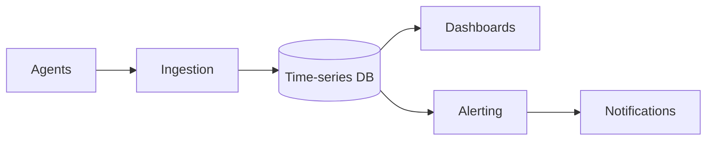

# Design a metrics and monitoring system (like Datadog or Prometheus)

> Collect, store, and query time-series metrics from many services, with dashboards and alerts.

## Requirements

- Ingest a high volume of metrics (counters, gauges, timings) from many sources.
- Store time-series data efficiently.
- Query and aggregate for dashboards.
- Alert when thresholds are crossed.

## Key ideas

- Ingestion: agents push metrics, or the system scrapes endpoints, through a [queue](../patterns/message-queues.md) to absorb spikes.
- Storage: a time-series database stores points keyed by metric plus labels and time. Old data is downsampled and expired by retention.
- Write volume is the core challenge: aggregate in time windows rather than storing every raw point forever.
- Alerting: rules evaluate recent windows and fire through a [notification system](design-notification-system.md).

## High-level design

## Go deeper

- Quick, focused prep: [System Design Interview Crash Course](https://www.designgurus.io/course/system-design-interview-crash-course)
- Full course: [Grokking the System Design Interview](https://www.designgurus.io/course/grokking-the-system-design-interview)