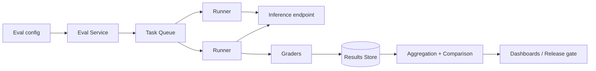

# Design a model evaluation pipeline

> A system that continuously measures model quality: run benchmark suites against model versions, compare candidates against production, and gate releases on the results.

## 1. Requirements

**Functional**
- Register evaluation suites: datasets of prompts with graders (exact match, rubric, LLM-as-judge, human review).
- Run a suite against a model version on demand and on a schedule.
- Compare two runs (candidate vs baseline) and report regressions per slice.
- Gate deployments: a release proceeds only if eval results clear thresholds.

**Non-functional**
- Throughput over latency: a nightly run may be millions of generations.
- Reproducibility: the same run request produces comparable results.
- Cost control: eval traffic competes with production for GPU capacity.

## 2. High-level design

An eval run fans out into thousands of independent (prompt, model, grader) tasks: an embarrassingly parallel batch workload on top of a [job scheduler](design-distributed-job-scheduler.md).

- Eval service: expands a run into tasks, tracks run state.
- Runners: pull tasks from the [queue](../patterns/message-queues.md), call the model, then the grader, write row-level results.
- Aggregation: computes metrics per suite and per slice (language, topic, difficulty), then statistical comparison against the baseline run.

## 3. Data model

- Suite: id, version, dataset ref, grader config.
- Run: id, suite version, model version, sampling params, code version, status.
- Result row: run id, item id, model output, grader scores, latency, cost.

Version everything. A comparison is only valid when suite version and grader version match across the two runs; interviewers probe whether you catch that a grader change invalidates history.

## 4. Deep dive: LLM-as-judge

Rubric grading by a strong LLM scales where humans cannot, but it is a measurement instrument with its own error:

- Pin the judge model version; a judge upgrade shifts every score.
- Calibrate against a human-labeled subset; track judge-human agreement over time.
- Debias: randomize A/B position in pairwise comparisons, since judges favor the first answer.
- Sample a fraction of judgments for ongoing human audit rather than auditing everything.

## 5. Deep dive: making results trustworthy

- Determinism: temperature-0 is not fully deterministic on GPUs (batching and kernel nondeterminism), so run multiple samples and report confidence intervals rather than pretending single numbers are exact.
- Contamination: keep held-out sets private and rotate them; if a benchmark leaks into training data, it silently inflates.
- Regression detection is a statistics problem: with 50 slices, some will "regress" by chance; use significance thresholds, not raw deltas.
- [Idempotent](../patterns/idempotency.md) task execution keyed by (run id, item id), so retried tasks do not double-count.

## 6. Release gating

Wire the pipeline into deployment: candidate model → smoke suite (minutes, blocking) → full nightly suite → canary in production with online metrics. Offline evals catch capability regressions; only online traffic catches distribution shift. Say both.

## 7. Bottlenecks and trade-offs

- GPU capacity: schedule big runs off-peak, use a lower-priority queue that production preempts.
- Cost vs coverage: full suites on every commit is unaffordable; tier suites (smoke, standard, full) by trigger.
- Results store grows fast (row per item per run); keep row-level data hot for weeks, aggregates forever.

## Go deeper

- AI foundations: [Grokking Modern AI Fundamentals](https://www.designgurus.io/course/grokking-modern-ai-fundamentals)
- Full course: [Grokking the System Design Interview](https://www.designgurus.io/course/grokking-the-system-design-interview)