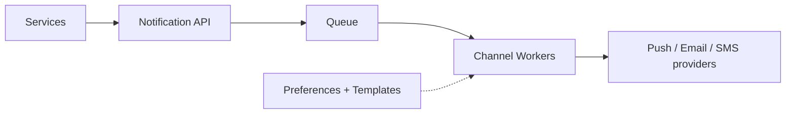

# Design a notification system

> A service that sends notifications to users across multiple channels (push, email, SMS, in-app) reliably and at scale.

## 1. Requirements

**Functional**
- Send notifications over several channels: push, email, SMS, in-app.
- Support templates and personalization.
- Respect user preferences and opt-outs.

**Non-functional**
- High throughput (large fan-out events).
- Reliable delivery with retries.
- Asynchronous; sending must not block the caller.

## 2. High-level design

The system is queue-driven so producers never wait on slow third-party providers:

- The API validates and enqueues a request quickly.
- Channel-specific workers pull from the [queue](../patterns/message-queues.md) and call the right external provider.

## 3. Key components

- Preferences service: which channels a user allows, and quiet hours.
- Template service: renders the message body per channel and locale.
- Deduplication: avoid sending the same notification twice (idempotency keys).
- Rate limiting: cap how often a user is notified (see [rate limiting](../patterns/rate-limiting.md)).

## 4. Deep dive

- Reliability: providers fail, so retry with backoff and use a dead letter queue for repeated failures.
- Fan-out: a single event (for example a post to many followers) can generate millions of notifications; fan out asynchronously through the queue.
- Delivery guarantees: at-least-once with idempotent sends avoids duplicates.
- Tracking: record sent, delivered, and failed for observability.

## 5. Bottlenecks and trade-offs

- Third-party provider limits and latency; isolate per channel so one slow provider does not block others.
- Fan-out spikes; the queue absorbs them, workers drain at a safe rate.
- Exactly-once is expensive; at-least-once plus dedup is the practical choice.

## Go deeper

- Practice live: [Mock interviews](https://www.designgurus.io/mock-interviews)
- Full course: [Grokking the System Design Interview](https://www.designgurus.io/course/grokking-the-system-design-interview)