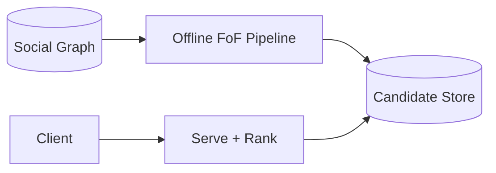

# Design "People You May Know" (Facebook)

> Suggest people a user might know, primarily from mutual connections in the social graph.

## Requirements

- Suggest relevant people to connect with.
- Use mutual friends and shared signals (school, workplace, location).
- Scale to a huge social graph.
- Refresh as the graph changes.

## Key ideas

- The core signal is "friends of friends": people two hops away in the graph, ranked by number of mutual connections.
- Computing this live for every user is too expensive, so precompute candidates offline (a graph or batch pipeline) and serve them from a fast store.
- Rank candidates by mutual-friend count plus other signals, similar to a [recommendation system](design-recommendation-system.md).
- The graph is partitioned; two-hop queries must avoid scanning the whole graph.

## High-level design

## Go deeper

- Quick, focused prep: [System Design Interview Crash Course](https://www.designgurus.io/course/system-design-interview-crash-course)
- Full course: [Grokking the System Design Interview](https://www.designgurus.io/course/grokking-the-system-design-interview)