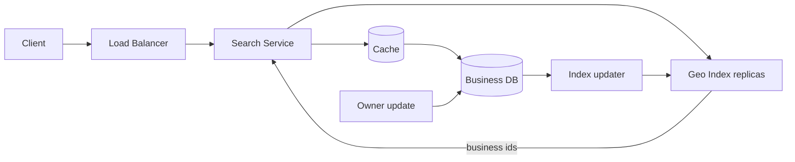

# Design a proximity service (Yelp)

> Given a location, return nearby businesses, filtered and ranked, at read-heavy scale.

## 1. Requirements

**Functional**
- Search for businesses within a radius of a point, with filters (category, open now, minimum rating).
- View a business detail page (name, hours, photos, review summary).
- Owners add or update listings. Updates are rare compared to searches.

**Non-functional**
- Read-heavy: searches outnumber updates by 100:1 or more.
- Search results in under 100 ms.
- A listing update can take up to a minute to appear in search results.

## 2. Estimation

Around 200M businesses, with a peak of about 100k searches per second. The core record for a business is small (roughly 1 KB), so the whole dataset is a few hundred GB and fits in memory across a handful of machines. See the [estimation cheat sheet](../cheat-sheets/estimation.md).

## 3. The core problem: two dimensions

The naive query is `WHERE lat BETWEEN a AND b AND lon BETWEEN c AND d`. A B-tree (the default sorted index in most databases, see [database indexing](../patterns/database-indexing.md)) sorts on one column. It can narrow the latitude range quickly, but it then scans every business in that latitude band around the whole world to check longitude. Range queries in two dimensions need a spatial index: a structure that maps points close in space to entries close in the index.

## 4. Spatial index options

| Option | How it works | Trade-off |
|--------|--------------|-----------|
| Geohash | Encode lat/lon into a string. Nearby places share a prefix, so one prefix lookup finds a cell. | Fixed grid. Two close points can fall in different cells, so search your cell plus its 8 neighbors. |
| Quadtree | Recursively split the map into four squares, splitting again wherever a square holds too many businesses. | Adapts to density (Manhattan gets tiny cells, a desert gets one big cell), but you must build and maintain the tree. |
| S2 / H3 cells | Production-grade cell libraries (Google S2, Uber H3) with better behavior at cell edges and poles. | More concepts to learn; usually overkill to derive in an interview. |

Any one of these, explained well, passes. Geohash is the easiest to reason about out loud.

## 5. Serving a search: two steps

1. **Geo lookup.** An in-memory geo index takes the point and radius and returns matching business ids. The index is read-only at serve time. It is rebuilt, or incrementally updated, from the business database, and [replicated](../patterns/replication.md) across many servers. Replication is what makes 100k reads per second cheap.
2. **Hydrate.** Fill in the details: fetch the full records for those ids from a [cache](../patterns/caching.md), falling back to the database, then apply filters and rank.

This split is the key contrast with [Uber](design-uber.md). Drivers move every few seconds, so Uber's location index must absorb heavy writes. Businesses almost never move, so this index can be read-only and copied freely.

## 6. Deep dive

**Precision.** Geohash length sets the cell size. Length 6 is roughly a city block; length 4 is roughly a town. Pick the length whose cells are close to the search radius: a "restaurants near me" query reads a few small cells, and a "hotels near the next city" query reads a few large ones.

**Ranking.** Distance is a factor, not the sort order. Blend distance with rating, review count, and how well the business matches the query. A slightly farther 4.8-star restaurant should beat the 2-star one next door.

## 7. Bottlenecks and trade-offs

- Index freshness vs rebuild cost: a periodic full rebuild is simple but stale; incremental updates are fresher but harder to keep correct. The one-minute freshness budget lets you batch updates.
- Hot cells: dense downtown cells receive most of the traffic. Add more replicas and cap the results read per cell.
- Pagination: the ranked set shifts as data changes, so page 2 by offset can repeat or skip results. Return a cursor (a token that records where the last page ended) tied to one index version.

## High-level design

## Go deeper

- Related: [Design Google Maps](design-google-maps.md) covers the map data itself, not just the points near you.
- Full course: [Grokking the System Design Interview](https://www.designgurus.io/course/grokking-the-system-design-interview?utm_source=github&utm_medium=repo&utm_campaign=grokking-system-design&utm_content=questions-design-proximity-service)
