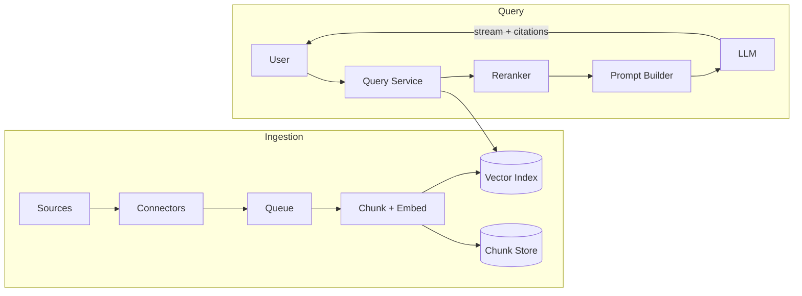

# Design a RAG pipeline

> A retrieval-augmented generation system: answer user questions over a private document corpus by retrieving relevant passages and feeding them to an LLM.

## 1. Requirements

**Functional**
- Ingest documents (PDFs, wikis, tickets) and keep them searchable as they change.
- Given a user question, retrieve the most relevant passages and generate a grounded answer.
- Cite sources, so users can verify the answer.
- Respect document permissions: users only get answers from documents they can read.

**Non-functional**
- Answer latency of a few seconds end to end.
- Freshness: an updated document should be reflected within minutes.
- Scale: millions of documents, thousands of concurrent queries.

## 2. The two pipelines

A RAG system is really two systems with different shapes:

| Pipeline | Shape | Latency target |
|----------|-------|----------------|
| Ingestion (offline) | High-throughput batch and stream processing | Minutes |
| Query (online) | Low-latency request path | Seconds |

Keep them separate. Interviewers probe whether you notice that ingestion is a [batch vs stream](../patterns/batch-vs-stream-processing.md) problem while query is a latency problem.

## 3. Ingestion pipeline

1. Connectors pull documents from sources (or receive change events).
2. Parse and chunk: split documents into passages (by structure, with overlap) small enough to embed and feed to the model.
3. Embed each chunk with an embedding model into a vector.
4. Index: write vectors to a vector index and chunk text plus metadata (source, permissions, timestamp) to a document store.

Change handling: on document update, re-chunk and re-embed only that document, and delete stale chunks. An event stream ([message queue](../patterns/message-queues.md)) between connectors and the embedder absorbs bursts and lets you replay on failure. Make chunk writes [idempotent](../patterns/idempotency.md) keyed by document id and version, so retries do not duplicate chunks.

## 4. Query pipeline

1. Embed the user question with the same embedding model.
2. Retrieve top-k candidate chunks from the vector index, pre-filtered by the user's permissions.
3. Optionally rerank the candidates with a cross-encoder for better precision.
4. Assemble the prompt: question plus the selected chunks, within the model's context budget.
5. Generate with the LLM, streaming tokens to the user, with citations mapped back to chunk metadata.

Hybrid retrieval (vector similarity plus keyword BM25) beats either alone; exact identifiers and rare terms are where pure vector search misses.

## 5. Data model

- Chunk: id, document id, version, text, embedding, source URI, ACL, updated_at.
- The vector index holds (chunk id, embedding, filterable metadata). The chunk text lives in a document store; do not bloat the vector index with full text.

## 6. Deep dive: permission filtering

Filtering after retrieval is a correctness bug: if you fetch top 10 and the user can read none of them, they get nothing, and worse, a timing side channel can leak existence. Filter inside the index query (metadata pre-filter) or partition indexes by tenant. This is the most common follow-up in enterprise-flavored interviews.

## 7. Bottlenecks and trade-offs

- Chunking quality caps answer quality; no retrieval tuning fixes bad chunks.
- Embedding model changes require re-embedding the whole corpus; version the index so you can rebuild alongside and cut over.
- k is a latency vs quality dial: bigger k plus rerank improves grounding but adds cost.
- [Cache](../patterns/caching.md) frequent question embeddings and popular answers; semantic caching (serve a cached answer for a near-duplicate question) saves LLM cost but risks staleness.

## High-level design

## Go deeper

This walkthrough is written for a general system design round. For the AI-round version, which leads with data, evaluation, and cost, see [Design enterprise document Q and A](https://github.com/design-gurus/grokking-ai-system-design/blob/main/questions/design-enterprise-document-qa.md).

- AI system design: [Grokking the AI System Design Interview](https://www.designgurus.io/course/grokking-the-ai-system-design-interview)
- AI foundations: [Grokking Modern AI Fundamentals](https://www.designgurus.io/course/grokking-modern-ai-fundamentals)
- Full course: [Grokking the System Design Interview](https://www.designgurus.io/course/grokking-the-system-design-interview)
