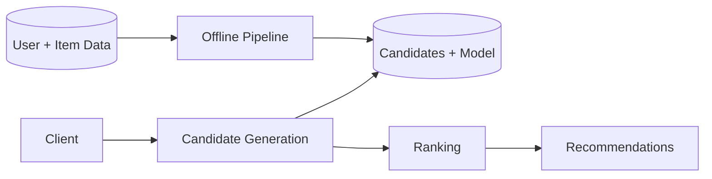

# Design a recommendation system

> Suggest relevant items (videos, products, posts) to each user, personalized and at scale.

## 1. Requirements

**Functional**
- Recommend items a user is likely to engage with.
- Personalize per user.
- Refresh as behavior changes.

**Non-functional**
- Serve recommendations with low latency.
- Scale to many users and items.
- Tolerate slightly stale recommendations.

## 2. Approaches

| Approach | Idea |
|----------|------|
| Collaborative filtering | Recommend what similar users liked |
| Content based | Recommend items similar to ones the user liked |
| Hybrid | Combine both, plus popularity and recency |

## 3. The two-stage pattern

Most large systems split recommendation into two stages:

1. Candidate generation: cheaply narrow billions of items to a few hundred candidates (for example by collaborative filtering or embeddings).
2. Ranking: a more expensive model scores those candidates for this user, and the top results are returned.

Heavy computation runs offline in a batch or streaming pipeline; the online serving layer reads precomputed candidates and applies the ranking model fast.

## 4. Deep dive

- Offline vs online: compute embeddings and candidates offline, serve and rank online.
- Feature store: shared features about users and items for training and serving.
- Cold start: new users and items lack history; fall back to popularity and content signals.
- Freshness vs cost: recompute periodically; do not rebuild everything per request.

## High-level design

## Go deeper

- Read more (free): [How to Design a Recommendation System](https://www.designgurus.io/blog/design-recommendation-system)
- For the full worked solution: [Advanced System Design Interview, Volume II](https://www.designgurus.io/course/grokking-system-design-interview-ii)
- Full course: [Grokking the System Design Interview](https://www.designgurus.io/course/grokking-the-system-design-interview)