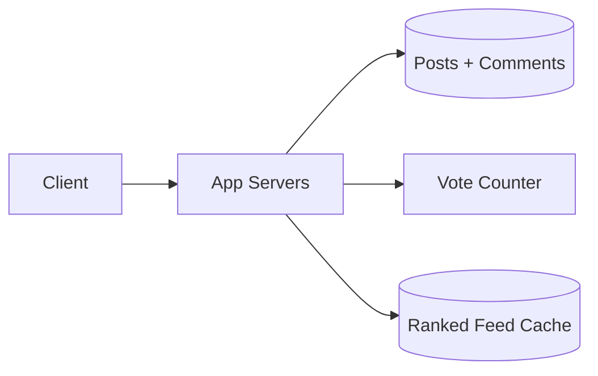

# Design Reddit

> A community platform with subreddits, posts, nested comments, voting, and ranked feeds.

## 1. Requirements

**Functional**
- Create posts in communities (subreddits).
- Nested comments (threads).
- Upvote and downvote posts and comments.
- Ranked feeds (hot, top, new).

**Non-functional**
- Read-heavy.
- Low-latency feeds.
- Eventual consistency on vote counts is fine.

## 2. Key challenges

- Vote counting at scale: votes are a high-volume counter problem (see the [likes counter](design-youtube-likes-counter.md) approach: sharded or aggregated, not one write per vote).
- Ranking: "hot" combines score and age so fresh, well-voted posts rise and decay over time. The rank is usually precomputed and cached, not computed per request.
- Nested comments: store a parent reference per comment; load a subtree and render the thread. Very deep threads are paginated or lazy-loaded.

## 3. Deep dive

- Feed generation: precompute ranked lists per subreddit, cache them, and refresh on a schedule rather than ranking on every read.
- Storage: posts and comments partitioned by subreddit or post id (see [sharding](../patterns/sharding-partitioning.md)).
- Caching: hot subreddit feeds and popular posts in a cache (see [caching](../patterns/caching.md)).

## 4. Trade-offs

- Vote accuracy vs write cost: aggregate counts, accept slight lag.
- Ranking freshness vs compute: recompute hot scores periodically.

## High-level design

## Go deeper

- For the full worked solution: [Advanced System Design Interview, Volume II](https://www.designgurus.io/course/grokking-system-design-interview-ii)
- Full course: [Grokking the System Design Interview](https://www.designgurus.io/course/grokking-the-system-design-interview)