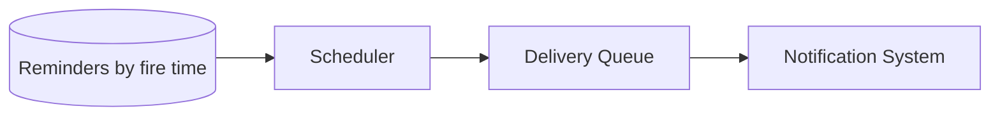

# Design a reminder and alert system

> Fire reminders at their scheduled time, at scale, reliably, even for millions of pending reminders.

## 1. Requirements

**Functional**
- Schedule a reminder to fire at a specific future time.
- Deliver it on time through one or more channels.
- Support cancel and update.

**Non-functional**
- Fire close to the scheduled time.
- Reliable (do not drop reminders).
- Scale to millions of pending reminders.

## 2. The core problem: efficient scheduling

You cannot scan every reminder constantly. Common designs:

| Approach | Idea |
|----------|------|
| Time-bucketed store | Store reminders keyed by their fire time; poll the buckets that are now due |
| Priority queue | Keep upcoming reminders ordered by fire time; pop those that are due |
| Timer wheel | A circular buffer of time slots; advance a pointer to find due items |

A practical pattern: persist reminders in a store partitioned by time, and a scheduler polls the near-future window, moving due reminders into a delivery [queue](../patterns/message-queues.md).

## 3. Deep dive

- Delivery: due reminders go to the [notification system](design-notification-system.md) to fan out across channels.
- Reliability: at-least-once delivery plus idempotency, so a retry does not double-fire.
- Scale: shard pending reminders by time so the scheduler only scans the current window.
- Accuracy vs load: a tighter polling interval fires more precisely but costs more reads.

## 4. Trade-offs

- Precision vs cost: poll more often for tighter timing, less often to save load.
- At-least-once plus dedup avoids both missed and duplicate reminders.

## High-level design

## Go deeper

- For the full worked solution: [Advanced System Design Interview, Volume II](https://www.designgurus.io/course/grokking-system-design-interview-ii)
- Full course: [Grokking the System Design Interview](https://www.designgurus.io/course/grokking-the-system-design-interview)