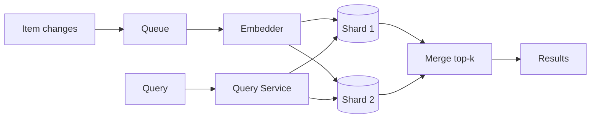

# Design semantic search (vector search)

> A search service that matches by meaning rather than keywords: embed items and queries as vectors, then find nearest neighbors at scale.

## 1. Requirements

**Functional**
- Index items (products, documents, images) so they are searchable by meaning.
- Given a query, return the top-k most similar items.
- Support metadata filters (category, price range, tenant, permissions).
- Handle inserts, updates, and deletes without full rebuilds.

**Non-functional**
- Query latency under ~100 ms at p99.
- Scale: hundreds of millions of vectors.
- Recall: approximate search is fine, but recall should be tunable.

## 2. Estimation

100M items with 768-dimensional float32 embeddings is 100M x 768 x 4 bytes, roughly 300 GB of raw vectors: too big for one machine's memory once you add index overhead. That single number drives the whole design: you must [shard](../patterns/sharding-partitioning.md), and you probably want compression.

## 3. Why not exact search

Exact nearest neighbor means comparing the query to every vector: O(n) per query. At 100M vectors that is seconds, not milliseconds. Everyone uses approximate nearest neighbor (ANN) indexes:

| Index | Idea | Trade-off |
|-------|------|-----------|
| HNSW | Graph of vectors, greedy search through layers | Best recall/latency, memory heavy |
| IVF | Cluster vectors, search only nearest clusters | Less memory, recall depends on clusters probed |
| PQ / quantization | Compress vectors to fewer bytes | Big memory savings, small recall loss |

A common production combo is IVF or HNSW with product quantization for memory. In the interview, name the recall vs latency vs memory triangle and pick one corner deliberately.

## 4. High-level design

- Write path: item changes flow through a [queue](../patterns/message-queues.md) to an embedding service, then to index shards.
- Read path: query service embeds the query, fans out to all shards, each returns local top-k, and a merger takes the global top-k (scatter-gather).
- Shard by item id hash, replicate each shard for read scaling and availability ([replication](../patterns/replication.md)).

## 5. Deep dive: updates and deletes

ANN indexes are built for reads; in-place updates degrade them. Common pattern: a small, fresh in-memory segment absorbs recent writes, searched alongside the big immutable segments, with periodic compaction merging segments (the LSM idea applied to vector indexes). Deletes are tombstones filtered at query time until compaction.

## 6. Deep dive: filtered search

"Top-k nearest that also match filter X" is harder than it sounds. Post-filtering (search, then filter) under-fills results when the filter is selective. Pre-filtering (restrict the candidate set first) is correct but can defeat the index. Real systems push filters into the index traversal, or partition indexes by high-selectivity keys like tenant. Interviewers use this to separate candidates who have run vector search in production from those who have read about it.

## 7. Bottlenecks and trade-offs

- Scatter-gather makes tail latency the max over shards; use hedged requests to tame p99.
- Embedding model version changes force reindexing; keep a versioned, rebuildable pipeline.
- Hybrid search (BM25 plus vectors) covers rare tokens and exact matches that embeddings miss.
- [Cache](../patterns/caching.md) hot query embeddings and results.

## Go deeper

- AI foundations: [Grokking Modern AI Fundamentals](https://www.designgurus.io/course/grokking-modern-ai-fundamentals)
- Full course: [Grokking the System Design Interview](https://www.designgurus.io/course/grokking-the-system-design-interview)