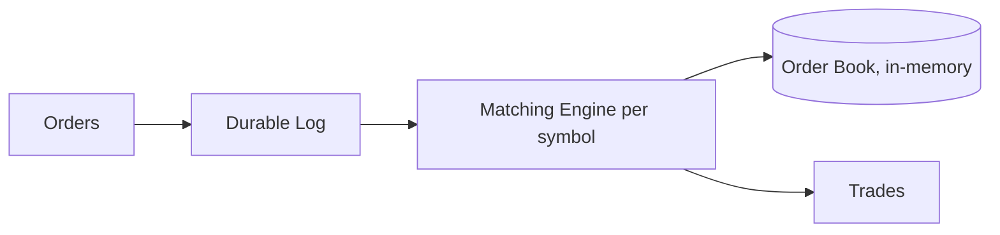

# Design a stock exchange

> A trading system that matches buy and sell orders fairly, with very low latency and strict correctness.

## Requirements

- Accept buy and sell orders and match them.
- Maintain an order book per symbol.
- Extremely low latency and high throughput.
- Fairness and correctness (no lost or duplicated trades).

## Key ideas

- Matching engine: per symbol, a matching engine maintains an order book (bids and asks) and matches incoming orders by price and time priority. It is often single-threaded per symbol for determinism, and kept in memory for speed.
- Sequencing: order events are written to a durable log first (an [event log](../deep-dives/kafka-distributed-messaging.md) style), so the system can replay and recover exactly.
- Partition by symbol: each symbol's book runs independently, so the system scales across symbols.
- Correctness over availability: trades must be exact.

## High-level design

## Go deeper

- Quick, focused prep: [System Design Interview Crash Course](https://www.designgurus.io/course/system-design-interview-crash-course)
- Full course: [Grokking the System Design Interview](https://www.designgurus.io/course/grokking-the-system-design-interview)