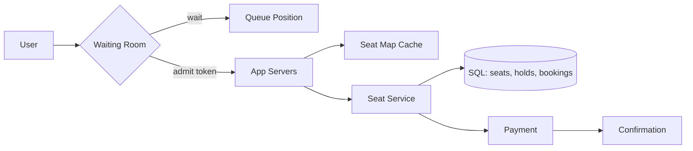

# Design Ticketmaster

> Sell seats to live events without ever selling the same seat twice, and survive the moment tickets go on sale.

## 1. Requirements

**Functional**
- Browse and search events.
- View a seat map showing which seats are still available.
- Hold selected seats for a few minutes while the buyer checks out.
- Purchase held seats and receive a confirmation.

**Non-functional**
- Zero double-sell (the same seat sold to two buyers). The booking path needs strong consistency.
- Survive on-sale spikes: a hot event brings 100x baseline traffic in the first seconds.
- The availability display may lag by a few seconds. The booking record may not.

## 2. Estimation

Size for one hot event: about 50k seats, and 1M or more people arriving in the first minute. Demand is more than 20x supply, so most visitors will not get a ticket. The job is to keep the system up and the bookings correct while they find out.

## 3. API

- `GET /events?query=...`: list and search events.
- `GET /events/{id}/seat-map`: seat layout with availability per seat.
- `POST /events/{id}/holds` with seat ids: returns a hold id and an expiry time.
- `POST /bookings` with hold id, payment token, and an idempotency key: confirms the purchase.

The idempotency key lets a buyer retry a purchase after a timeout without being charged twice. See [idempotency](../patterns/idempotency.md).

## 4. Data model

- Event: id, venue, date, status.
- Seat: id, event id, section, row, number, status (free, held, sold).
- Hold: id, user id, seat ids, expiry time.
- Booking: id, user id, seat ids, payment id, created_at.

Seats are identified inventory: every unit is a specific, named seat, so the model tracks each one as its own row. A [hotel reservation system](design-hotel-reservation.md) instead tracks counted inventory per room type per date. The booking path belongs in a transactional SQL store, because the double-sell guarantee is exactly what database transactions provide.

## 5. The virtual waiting room

During an on-sale, a virtual waiting room stands in front of the store. It is a gate that admits users at a rate the checkout path can actually serve, and gives everyone else a queue position token so they can see where they stand. The admit rate is tied to measured checkout capacity, not to incoming traffic. Behind the gate: a seat service handles the seat map, holds, and bookings; a [payment service](design-payment-system.md) charges the card; a confirmation flow issues the ticket.

## 6. Deep dive: the seat hold

A hold marks seats as taken while one buyer checks out. The clean way is a conditional update inside one transaction:

```sql
UPDATE seats SET status = 'held', hold_id = :h
WHERE event_id = :e AND seat_id IN (:ids) AND status = 'free';
```

If the updated row count is less than the number of seats requested, someone else got there first: roll back and tell the buyer. The database's own atomicity resolves the race, so this beats holding a [distributed lock](../patterns/distributed-locking.md) around the check-then-write. Optimistic locking (a version column checked on write) works the same way. Every hold carries a TTL (time to live, an expiry deadline), so an abandoned checkout releases its seats automatically.

## 7. Deep dive: the stale seat map

Millions of people refreshing the seat map must not touch the booking database. Serve the map from a [cache](../patterns/caching.md) that is updated every few seconds. That map can be stale, and that is fine: the purchase transaction is the source of truth. A stale map costs one user a "sorry, that seat was just taken" message at hold time. It can never cause a double-sell.

## 8. Bottlenecks and trade-offs

- Fairness vs throughput at the gate: strict first-come ordering needs one global queue, which is itself a bottleneck. Randomized admission within arrival batches scales better and is harder for bots to exploit.
- Bots and scalpers: [rate limiting](../patterns/rate-limiting.md) per IP and per account, verified accounts, and per-account purchase caps.
- Hot rows: one hot event is inherently one hot partition, and no sharding scheme removes that. Keep the transaction tiny (touch only the seat and booking rows), and push everything else (emails, analytics, ticket rendering) to a [message queue](../patterns/message-queues.md).

## High-level design



## Go deeper

- Related: [Design a flash sale system](design-flash-sale-system.md) (counted inventory instead of identified seats).
- Full course: [Grokking the System Design Interview](https://www.designgurus.io/course/grokking-the-system-design-interview)
