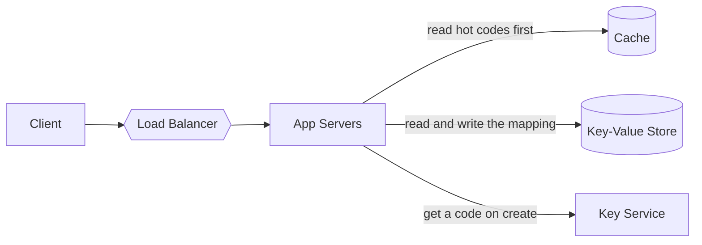
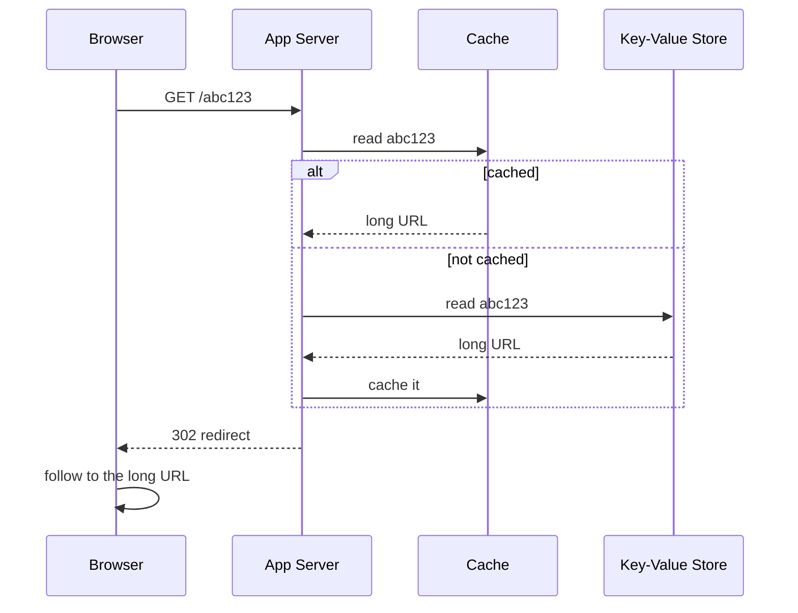

# Design TinyURL

> A URL shortening service that turns a long URL into a short, unique alias and redirects users from the alias to the original.

This is the standard first question, and it looks easier than it is graded. The design is small enough that you will finish early, which means the interviewer will spend most of the round on the parts below: how codes are generated, what happens at the read volume, and what you do when a component fails.

## 1. Requirements

**Functional**
- Given a long URL, return a short URL.
- Given a short URL, redirect to the original long URL.
- Optional: custom aliases, expiration dates, basic analytics.

**Non-functional**
- High availability (redirects must almost never fail).
- Low latency redirects.
- Read-heavy: redirects vastly outnumber creations (a common assumption is 100 reads per write).

Worth agreeing out loud before you design: shortening is not reversible by computation, so this is a storage problem, not an encoding problem. And a code, once handed out, can never be reused for a different URL, because links live in messages and documents forever.

## 2. Estimation

Assume 100 million new URLs per month.
- Writes: roughly 40 per second on average.
- Reads: at 100 to 1, roughly 4,000 per second.
- Storage: 100 million per month times 12 months times 5 years is 6 billion objects. At about 500 bytes each, that is around 3 TB over 5 years.

See the [estimation cheat sheet](../cheat-sheets/estimation.md) for the numbers behind this.

Say what these numbers rule out, because that is the point of computing them. Neither figure is large. Forty writes per second is nothing, 4,000 reads per second is comfortably served by a cache in front of one database, and 3 TB fits on a small number of machines. So the design is not interesting because of scale. It is interesting because of the code generation and the availability requirement.

## 3. API

- `POST /urls` with `{ longUrl, customAlias?, expiry? }` returns `{ shortUrl }`.
- `GET /{shortCode}` returns an HTTP 301 or 302 redirect to the long URL.

## 4. Data model

A single mapping is enough:

```
short_code (PK)  |  long_url  |  created_at  |  expiry  |  owner_id
```

Access pattern is a simple key lookup by `short_code`, so a key-value store or an indexed relational table both work well.

There are no joins, no range scans, and no secondary access pattern on the hot path. That single fact is the whole database argument, so say it rather than debating engines. See [SQL vs NoSQL](../cheat-sheets/sql-vs-nosql.md).

## 5. Generating the short code

Two common approaches:

| Approach | How | Trade-off |
|----------|-----|-----------|
| Hash the URL (for example base62 of a hash) | Take the first N characters of a hash | Simple, but collisions must be handled |
| Counter plus base62 encoding | A global counter, encoded to base62 | No collisions, but needs a distributed counter (for example a key generation service or ranges handed to each server) |

A pre-generated key service (a pool of unused keys handed out in batches) avoids collision checks on the hot path.

**How long does the code need to be?** Base62 uses `a-z`, `A-Z`, and `0-9`, so each character carries 62 possibilities:

| Length | Distinct codes |
|--------|----------------|
| 5 | about 916 million |
| 6 | about 56.8 billion |
| 7 | about 3.5 trillion |

You need 6 billion codes for five years. Six characters gives about 56.8 billion, so roughly nine times what you need. That is enough for a counter, which uses every value in order. It is not comfortable for random generation, where you start colliding long before you exhaust the space. Seven characters removes the question entirely at the cost of one character.

This is the answer worth having ready: **six if the codes are assigned in sequence, seven if they are random.**

**Why a key service beats checking for collisions.** If you generate randomly and check the database each time, every write costs a read, and the cost rises as the space fills. A key generation service pre-computes unused codes offline and hands them out in blocks. Each application server takes a block of, say, 1,000 codes and serves creations from memory. Collisions become impossible rather than unlikely, and the hot path loses a database round trip.

The cost is that codes in an unfinished block are lost when a server dies. At 6 billion available codes, losing a few thousand does not matter, and saying that out loud is the point.

## 6. High-level design



- Redirects read from a cache first (short codes are very read-heavy and cache well). See [caching](../patterns/caching.md).
- Creations write to the store and assign a code from the key service.

The redirect is the path that matters, so walk it explicitly:



Two things are worth naming as you draw it. The response is a redirect, so the browser makes a second request to a site you do not control, and your work is done in one lookup. And links are heavily skewed, so a small cache serves most traffic: a link that is being shared right now is requested constantly, and most links are never requested again.

## 7. Bottlenecks and trade-offs

- Read scaling: cache hot codes and add read replicas. See [replication](../patterns/replication.md).
- Code generation must avoid collisions and a single point of failure: use a key range service or [consistent hashing](../patterns/consistent-hashing.md) for distribution.
- 301 vs 302: 301 (permanent) is cacheable by browsers and reduces load but hides analytics; 302 (temporary) preserves analytics at the cost of more traffic.

The 301 versus 302 choice is the most common follow-up in this question, and the reasoning matters more than the answer. A 301 tells the browser to remember the mapping, so repeat visits never reach you at all. That is excellent for load and it means you stop counting clicks, and it means you can never change or disable that link for users who cached it. A 302 keeps every visit on your servers, which costs traffic and gives you analytics and the ability to revoke. Pick based on whether the product needs analytics, and say so.

## The deep dives to expect

**What happens when the cache goes down?** At a 4,000 reads per second, the database has to absorb all of it. That is survivable here, and saying so is the right answer. Notice that this is a question about whether the cache is an optimization or a load-bearing component. See [caching](../patterns/caching.md).

**How do you delete expired links?** Do not scan the table. Let the read path check the expiry and treat an expired code as missing, then reclaim the rows in a background job. The code itself should not go back into the pool.

**Can two users shorten the same long URL?** Decide and justify. Returning the same code for the same URL saves storage and breaks per-user analytics and expiry. Handing out a new code each time is simpler and usually the better default.

**How do custom aliases fit in?** They come from a different space than generated codes, so they need a uniqueness check on write, which is the one place a conditional write is required. Reserve them in the same table so a custom alias can never collide with a generated code.

**What about abuse?** Shorteners hide the destination, so they attract phishing. Mention [rate limiting](../patterns/rate-limiting.md) on creation and a check of the target against a blocklist.

## Related pages

- The pattern that carries this design: [caching](../patterns/caching.md).
- Generating unique identifiers at scale, in more depth: [design a unique ID generator](design-unique-id-generator.md).
- Protecting the creation endpoint: [design a rate limiter](design-rate-limiter.md).

## Go deeper

- Read more (free): [How to Design a URL Shortener](https://www.designgurus.io/blog/url-shortening?utm_source=github&utm_medium=repo&utm_campaign=grokking-system-design&utm_content=questions-design-tinyurl)
- Full course: [Grokking the System Design Interview](https://www.designgurus.io/course/grokking-the-system-design-interview?utm_source=github&utm_medium=repo&utm_campaign=grokking-system-design&utm_content=questions-design-tinyurl)
